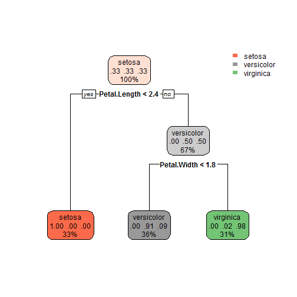
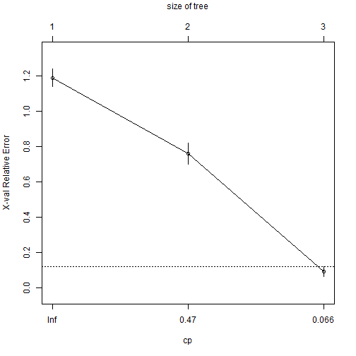
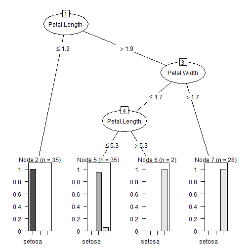

# Decision tree algorithm

                                  
                                **Author : Abas-Hamza**  
                                  
                                  
  
  
  
  
  
* **Abstract**
* **Getting and cleaning the data**
* **Exploration Analysis**
* **Model Building** 
* **Predicting**  
* **Evaluating model accuracy**  

                              


----------------------------------------------------------------------------------


* Abstract

Decision tree method is simple and useful for interpretation. It can be applied to both regression and classification problems. let's look at the primary differences between classification and regression trees:

* 1. Regression trees are used when dependent variable is continuous Whereas Classification trees are used when dependent variable is categorical.

* 2. In case of regression tree, the value obtained by terminal nodes in the training data is the mean response of observation falling in that region.

* 3. In case of classification tree, the value obtained by terminal node in the training data is the mode of observations falling in that region. if an unseen observation falls in that region, we'll make its prediction with mode value.

* 4. Both the trees follow a top-down greedy approach known as recursive binary splitting.


* 5. Once the tree is fully growned we may use Pruning Which  is one of the technique used to tackle overfitting.


A decision tree is constructed by a decision tree inducer. There are various decision tree inducers such as **ID3, C50, CART etc.**. Roughly speaking A decision tree inducer is an algorithm that automatically constructs a decision tree from a given dataset. The algorithm must follow a certain method. There are two methods used by the **decision tree inducers** in general. These include the widely used top-down method **Recursive Binary** and the less popular, bottom-up method.

There are 3 prominent attribute selection measures for decision tree induction: 

* Information gain - used in the ID3 algorithm 

* Gain ratio - used in the C4.5 algorithm 

* Gini index - used in the CART algorithm 

Once the decision tree is constructed by the the inducer, we then perform Tree pruning which is the process of removing the unnecessary structure from a decision tree in order to make it more efficient and more intuitive for readability. An increased accuracy in the decision tree model is due to pruning's ability to reduce overfitting. 


```
## Loading required package: rattle
```

# Getting and cleaning the data


```r
# Getting data and summarizing

 data("iris")
 summary(iris)
```

```
##   Sepal.Length    Sepal.Width     Petal.Length    Petal.Width   
##  Min.   :4.300   Min.   :2.000   Min.   :1.000   Min.   :0.100  
##  1st Qu.:5.100   1st Qu.:2.800   1st Qu.:1.600   1st Qu.:0.300  
##  Median :5.800   Median :3.000   Median :4.350   Median :1.300  
##  Mean   :5.843   Mean   :3.057   Mean   :3.758   Mean   :1.199  
##  3rd Qu.:6.400   3rd Qu.:3.300   3rd Qu.:5.100   3rd Qu.:1.800  
##  Max.   :7.900   Max.   :4.400   Max.   :6.900   Max.   :2.500  
##        Species  
##  setosa    :50  
##  versicolor:50  
##  virginica :50  
##                 
##                 
## 
```


# Model Building


 To understand how well our learner performs on unseen dataset we   divide our data into two portions a training dataset and testset.
The training set should be used to build our machine learning model and The test set should be used to see how well our model performs on unseen data. We will now perform **Decision tree ** using the rpart() function. 


```r
set.seed(2)
shufledata <- sample(nrow(iris),100)
traindata <- iris[shufledata,]
testdata <- iris[-shufledata,]

model1 <- rpart(Species~. , data = iris, method = "class")
print(model1)
```

```
## n= 150 
## 
## node), split, n, loss, yval, (yprob)
##       * denotes terminal node
## 
## 1) root 150 100 setosa (0.33333333 0.33333333 0.33333333)  
##   2) Petal.Length< 2.45 50   0 setosa (1.00000000 0.00000000 0.00000000) *
##   3) Petal.Length>=2.45 100  50 versicolor (0.00000000 0.50000000 0.50000000)  
##     6) Petal.Width< 1.75 54   5 versicolor (0.00000000 0.90740741 0.09259259) *
##     7) Petal.Width>=1.75 46   1 virginica (0.00000000 0.02173913 0.97826087) *
```

Now everything is ready, We've divided the data into training and test, we then predict.


```r
 predfunc <- predict(model1,testdata,type = "class")
```
# Visualize the tree


```r
library(rpart.plot)
 rpart.plot(model1)
```



```r
 plotcp(model1)
```



# The **cptable** can be extracted. The results are shown as follows:


```r
printcp(model1)
```

```
## 
## Classification tree:
## rpart(formula = Species ~ ., data = iris, method = "class")
## 
## Variables actually used in tree construction:
## [1] Petal.Length Petal.Width 
## 
## Root node error: 100/150 = 0.66667
## 
## n= 150 
## 
##     CP nsplit rel error xerror     xstd
## 1 0.50      0      1.00   1.19 0.049592
## 2 0.44      1      0.50   0.76 0.061232
## 3 0.01      2      0.06   0.09 0.029086
```


The cptable provides a summary of the model.  The "CP" column lists the values of the complexity parameter, the number of split is listed under"nsplit", and the column "xerror" contains cross-validated classification error rates; the standard deviation of the cross-validation error rates are in the "xstd" column. We may select a tree size that minimizes the cross-validated error, which is shown in the "xerror" column. the following code stores the optimal complexity parameter and the least classification error rate. 


```r
optimize <-  model1$cptable[which.min(model1$cptable[,"xerror"]),"CP"]
 # Now we can prun the model

prunedModel <- prune(model1,cp=optimize)
```


# Predict and Evaluation


```r
predfunc <- predict(model1,testdata,type = "class")
confusionMatrix(predfunc,testdata$Species)
```

```
## Confusion Matrix and Statistics
## 
##             Reference
## Prediction   setosa versicolor virginica
##   setosa         15          0         0
##   versicolor      0         16         1
##   virginica       0          1        17
## 
## Overall Statistics
##                                           
##                Accuracy : 0.96            
##                  95% CI : (0.8629, 0.9951)
##     No Information Rate : 0.36            
##     P-Value [Acc > NIR] : < 2.2e-16       
##                                           
##                   Kappa : 0.9398          
##  Mcnemar's Test P-Value : NA              
## 
## Statistics by Class:
## 
##                      Class: setosa Class: versicolor Class: virginica
## Sensitivity                    1.0            0.9412           0.9444
## Specificity                    1.0            0.9697           0.9688
## Pos Pred Value                 1.0            0.9412           0.9444
## Neg Pred Value                 1.0            0.9697           0.9688
## Prevalence                     0.3            0.3400           0.3600
## Detection Rate                 0.3            0.3200           0.3400
## Detection Prevalence           0.3            0.3400           0.3600
## Balanced Accuracy              1.0            0.9554           0.9566
```

```r
rpart.plot(prunedModel)
```


# Improving model performance with **C50** algoritm.

I will develop a simple model using C5.0 decision trees. The C50 algoritm takes 3 arguments : 

* **train** Which is a data frame containing data without the class inputs

* **class** which is a factor vector with the class in the training data

* **trials** an optional number to control the number of boosting


```r
library(C50)
modeltwo <- C5.0(traindata[-5],traindata$Species)
summary(modeltwo)
```

```
## 
## Call:
## C5.0.default(x = traindata[-5], y = traindata$Species)
## 
## 
## C5.0 [Release 2.07 GPL Edition]  	Wed Sep 13 09:18:29 2017
## -------------------------------
## 
## Class specified by attribute `outcome'
## 
## Read 100 cases (5 attributes) from undefined.data
## 
## Decision tree:
## 
## Petal.Length <= 1.9: setosa (35)
## Petal.Length > 1.9:
## :...Petal.Width > 1.7: virginica (28)
##     Petal.Width <= 1.7:
##     :...Petal.Length <= 5.3: versicolor (35/2)
##         Petal.Length > 5.3: virginica (2)
## 
## 
## Evaluation on training data (100 cases):
## 
## 	    Decision Tree   
## 	  ----------------  
## 	  Size      Errors  
## 
## 	     4    2( 2.0%)   <<
## 
## 
## 	   (a)   (b)   (c)    <-classified as
## 	  ----  ----  ----
## 	    35                (a): class setosa
## 	          33          (b): class versicolor
## 	           2    30    (c): class virginica
## 
## 
## 	Attribute usage:
## 
## 	100.00%	Petal.Length
## 	 65.00%	Petal.Width
## 
## 
## Time: 0.0 secs
```

```r
plot(modeltwo)
```



```r
set.seed(123)
predictmodel <- predict(modeltwo, testdata)
confusionMatrix(predictmodel,testdata$Species)
```

```
## Confusion Matrix and Statistics
## 
##             Reference
## Prediction   setosa versicolor virginica
##   setosa         15          0         0
##   versicolor      0         16         1
##   virginica       0          1        17
## 
## Overall Statistics
##                                           
##                Accuracy : 0.96            
##                  95% CI : (0.8629, 0.9951)
##     No Information Rate : 0.36            
##     P-Value [Acc > NIR] : < 2.2e-16       
##                                           
##                   Kappa : 0.9398          
##  Mcnemar's Test P-Value : NA              
## 
## Statistics by Class:
## 
##                      Class: setosa Class: versicolor Class: virginica
## Sensitivity                    1.0            0.9412           0.9444
## Specificity                    1.0            0.9697           0.9688
## Pos Pred Value                 1.0            0.9412           0.9444
## Neg Pred Value                 1.0            0.9697           0.9688
## Prevalence                     0.3            0.3400           0.3600
## Detection Rate                 0.3            0.3200           0.3400
## Detection Prevalence           0.3            0.3400           0.3600
## Balanced Accuracy              1.0            0.9554           0.9566
```

```r
# Boosting 

boostingmodel <- C5.0(traindata[-5],traindata$Species,trials = 10)
boostingmodel
```

```
## 
## Call:
## C5.0.default(x = traindata[-5], y = traindata$Species, trials = 10)
## 
## Classification Tree
## Number of samples: 100 
## Number of predictors: 4 
## 
## Number of boosting iterations: 10 
## Average tree size: 4.1 
## 
## Non-standard options: attempt to group attributes
```

```r
summary(boostingmodel)
```

```
## 
## Call:
## C5.0.default(x = traindata[-5], y = traindata$Species, trials = 10)
## 
## 
## C5.0 [Release 2.07 GPL Edition]  	Wed Sep 13 09:18:30 2017
## -------------------------------
## 
## Class specified by attribute `outcome'
## 
## Read 100 cases (5 attributes) from undefined.data
## 
## -----  Trial 0:  -----
## 
## Decision tree:
## 
## Petal.Length <= 1.9: setosa (35)
## Petal.Length > 1.9:
## :...Petal.Width > 1.7: virginica (28)
##     Petal.Width <= 1.7:
##     :...Petal.Length <= 5.3: versicolor (35/2)
##         Petal.Length > 5.3: virginica (2)
## 
## -----  Trial 1:  -----
## 
## Decision tree:
## 
## Petal.Length <= 1.9: setosa (26.4)
## Petal.Length > 1.9:
## :...Petal.Width <= 1.4: versicolor (18.1/0.8)
##     Petal.Width > 1.4: virginica (55.4/7.6)
## 
## -----  Trial 2:  -----
## 
## Decision tree:
## 
## Petal.Length <= 1.9: setosa (20.4)
## Petal.Length > 1.9:
## :...Petal.Width > 1.6: virginica (29/2.7)
##     Petal.Width <= 1.6:
##     :...Petal.Length <= 4.9: versicolor (34.6)
##         Petal.Length > 4.9: virginica (15.9/2.7)
## 
## -----  Trial 3:  -----
## 
## Decision tree:
## 
## Petal.Length <= 1.9: setosa (15.6)
## Petal.Length > 1.9:
## :...Petal.Width > 1.7: virginica (12.5)
##     Petal.Width <= 1.7:
##     :...Sepal.Width <= 2.6: virginica (24.3/6.9)
##         Sepal.Width > 2.6: versicolor (47.6/0.4)
## 
## -----  Trial 4:  -----
## 
## Decision tree:
## 
## Petal.Length <= 1.9: setosa (12)
## Petal.Length > 1.9:
## :...Petal.Length > 5.1: virginica (10.5)
##     Petal.Length <= 5.1:
##     :...Sepal.Width <= 2.2: virginica (8/2.1)
##         Sepal.Width > 2.2:
##         :...Sepal.Length <= 4.9: virginica (8/2.1)
##             Sepal.Length > 4.9:
##             :...Petal.Width <= 1.7: versicolor (58.7)
##                 Petal.Width > 1.7: virginica (2.7)
## 
## -----  Trial 5:  -----
## 
## Decision tree:
## 
## Petal.Length <= 1.9: setosa (9.1)
## Petal.Length > 1.9:
## :...Petal.Width <= 1.3: versicolor (43.5)
##     Petal.Width > 1.3:
##     :...Petal.Length > 5.1: virginica (8)
##         Petal.Length <= 5.1:
##         :...Sepal.Width <= 2.6: virginica (12/2.8)
##             Sepal.Width > 2.6: versicolor (27.4/1.8)
## 
## -----  Trial 6:  -----
## 
## Decision tree:
## 
## Petal.Width > 1.7: virginica (25.9)
## Petal.Width <= 1.7:
## :...Petal.Width <= 0.6: setosa (7)
##     Petal.Width > 0.6: versicolor (67.2/9)
## 
## -----  Trial 7:  -----
## 
## Decision tree:
## 
## Petal.Width <= 1.3: versicolor (31/5.4)
## Petal.Width > 1.3:
## :...Petal.Width > 1.7: virginica (20)
##     Petal.Width <= 1.7:
##     :...Petal.Length > 5.3: virginica (12.4)
##         Petal.Length <= 5.3:
##         :...Sepal.Width <= 2.6: virginica (21.5/4.4)
##             Sepal.Width > 2.6: versicolor (15.1)
## 
## -----  Trial 8:  -----
## 
## Decision tree:
## 
## Petal.Length <= 1.9: setosa (25)
## Petal.Length > 1.9:
## :...Petal.Width <= 1.3: versicolor (19.9)
##     Petal.Width > 1.3: virginica (55.1/16.6)
## 
## -----  Trial 9:  -----
## 
## Decision tree:
## 
## Petal.Length <= 1.9: setosa (20)
## Petal.Length > 1.9:
## :...Petal.Width > 1.7: virginica (12.5)
##     Petal.Width <= 1.7:
##     :...Petal.Length <= 5.3: versicolor (59.9/10.6)
##         Petal.Length > 5.3: virginica (7.7)
## 
## 
## Evaluation on training data (100 cases):
## 
## Trial	    Decision Tree   
## -----	  ----------------  
## 	  Size      Errors  
## 
##    0	     4    2( 2.0%)
##    1	     3   11(11.0%)
##    2	     4    2( 2.0%)
##    3	     4   13(13.0%)
##    4	     6    2( 2.0%)
##    5	     5    8( 8.0%)
##    6	     3    4( 4.0%)
##    7	     5   36(36.0%)
##    8	     3   14(14.0%)
##    9	     4    2( 2.0%)
## boost	          0( 0.0%)   <<
## 
## 
## 	   (a)   (b)   (c)    <-classified as
## 	  ----  ----  ----
## 	    35                (a): class setosa
## 	          33          (b): class versicolor
## 	                32    (c): class virginica
## 
## 
## 	Attribute usage:
## 
## 	100.00%	Petal.Length
## 	100.00%	Petal.Width
## 	 45.00%	Sepal.Width
## 	 41.00%	Sepal.Length
## 
## 
## Time: 0.0 secs
```

```r
predictboost <- predict(boostingmodel, testdata)
confusionMatrix(predictboost,testdata$Species)
```

```
## Confusion Matrix and Statistics
## 
##             Reference
## Prediction   setosa versicolor virginica
##   setosa         15          0         0
##   versicolor      0         15         1
##   virginica       0          2        17
## 
## Overall Statistics
##                                           
##                Accuracy : 0.94            
##                  95% CI : (0.8345, 0.9875)
##     No Information Rate : 0.36            
##     P-Value [Acc > NIR] : < 2.2e-16       
##                                           
##                   Kappa : 0.9097          
##  Mcnemar's Test P-Value : NA              
## 
## Statistics by Class:
## 
##                      Class: setosa Class: versicolor Class: virginica
## Sensitivity                    1.0            0.8824           0.9444
## Specificity                    1.0            0.9697           0.9375
## Pos Pred Value                 1.0            0.9375           0.8947
## Neg Pred Value                 1.0            0.9412           0.9677
## Prevalence                     0.3            0.3400           0.3600
## Detection Rate                 0.3            0.3000           0.3400
## Detection Prevalence           0.3            0.3200           0.3800
## Balanced Accuracy              1.0            0.9260           0.9410
```


# Conclusion

In this project I applied **Decision Tree** algorithm using **rpart()** function and **C50**. **Decision tree** is a non-parametric algorithm that makes predictions using tree based model. **Decision tree** method is simple and useful for interpretation. It can be applied to both regression and classification problems. Once the decision tree is constructed by the the inducer, I performed Tree pruning which is the process of removing the unnecessary structure from a decision tree in order to make it more efficient. I hope that this article covers the practical approach of  **decision tree** algorithm. 


