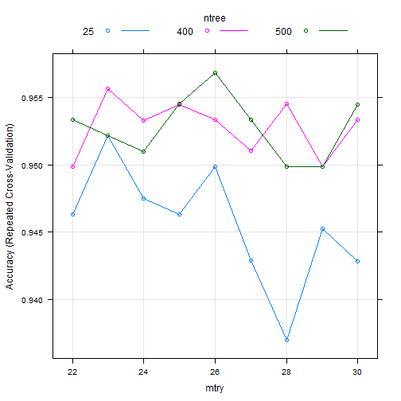

# predict the Tumour type using ensemble algorithm 


                                  
                                **Author : Abas-Hamza**  
                                  
                                  
  
  
  
  
  
* **Abstract**
* **Getting and cleaning the data**
* **Exploration Analysis**
* **Model Building** 
* **Predicting**  
* **Evaluating model accuracy**  

                              


----------------------------------------------------------------------------------


* Abstract


Ensemble based methods are highly superior than the weak learners and offer one of the most convincing way to build highly accurate predictive models. **ensemble methods** use multiple learning algorithms to obtain better predictive performance.
In general an ensemble methods combine the outcome of different models and then select the most appropriate one by voting. **Ensemble based methods** train the same algorithm with different subset of the data. This allows for much more flexible model. An ensemble is itself a supervised learning algorithm, meaning that it can be trained and then used to make predictions on inseen data. we can combine multiple models that are based on same algorithms, but combining multiple predictions generated by different algorithms provide better predictions and less noisy . The goal of using **Ensemble based methods** is to reduce the variance and to avoid the over-fitting. There are various approaches to performe **Ensemble based methods** such as **Bagging**, **RandomForest** or different classifiers that may be combined to create a robust model. In this project I'm  going to build a very high classification model using **random forest** algorithm that will combine random decision trees with bagging. Random Forests are an improvement over bagged decision trees. Unlike simple decision trees which has high correlation in their predictions, **ensembles algorithms ** work better if the predictions from the sub-models are uncorrelated or weakly correlated. The data that I am going to use is Wisconsin Breast Cancer Diagnostic dataset from the UCI Machine Learning Repository at **http://archive.ics.uci.edu/ml** .This data was donated by researchers of the University of Wisconsin and includes the measurements from digitized images of fine-needle aspirate of a breast mass. The data includes 569 observations of cancer biopsies, each with  32 features. The target feature is the cancer diagnosis coded as  "M" to indicate malignant and "B" to indicate benign. The data has been split into two groups: training set (train.csv) and test set (test.csv). The training set should be used to build our machine learning model and The test set should be used to see how well our model performs on unseen data. 


 


```
## Loading required package: rattle
```

```
## Loading required package: randomForest
```

```
## randomForest 4.6-12
```

```
## Type rfNews() to see new features/changes/bug fixes.
```

```
## 
## Attaching package: 'randomForest'
```

```
## The following object is masked from 'package:psych':
## 
##     outlier
```

```
## The following object is masked from 'package:dplyr':
## 
##     combine
```

```
## The following object is masked from 'package:ggplot2':
## 
##     margin
```

```
## Loading required package: kernlab
```

```
## 
## Attaching package: 'kernlab'
```

```
## The following object is masked from 'package:psych':
## 
##     alpha
```

```
## The following object is masked from 'package:ggplot2':
## 
##     alpha
```

```
## 
## Attaching package: 'caretEnsemble'
```

```
## The following object is masked from 'package:ggplot2':
## 
##     autoplot
```

# Getting and cleaning the data


```r
maindata <- read.csv("breast_Cancer_data.csv", header = TRUE, stringsAsFactors = FALSE)
dim(maindata)
```

```
## [1] 569  33
```

```r
summary(maindata)
```

```
##        id             diagnosis          radius_mean      texture_mean  
##  Min.   :     8670   Length:569         Min.   : 6.981   Min.   : 9.71  
##  1st Qu.:   869218   Class :character   1st Qu.:11.700   1st Qu.:16.17  
##  Median :   906024   Mode  :character   Median :13.370   Median :18.84  
##  Mean   : 30371831                      Mean   :14.127   Mean   :19.29  
##  3rd Qu.:  8813129                      3rd Qu.:15.780   3rd Qu.:21.80  
##  Max.   :911320502                      Max.   :28.110   Max.   :39.28  
##  perimeter_mean     area_mean      smoothness_mean   compactness_mean 
##  Min.   : 43.79   Min.   : 143.5   Min.   :0.05263   Min.   :0.01938  
##  1st Qu.: 75.17   1st Qu.: 420.3   1st Qu.:0.08637   1st Qu.:0.06492  
##  Median : 86.24   Median : 551.1   Median :0.09587   Median :0.09263  
##  Mean   : 91.97   Mean   : 654.9   Mean   :0.09636   Mean   :0.10434  
##  3rd Qu.:104.10   3rd Qu.: 782.7   3rd Qu.:0.10530   3rd Qu.:0.13040  
##  Max.   :188.50   Max.   :2501.0   Max.   :0.16340   Max.   :0.34540  
##  concavity_mean    concave.points_mean symmetry_mean   
##  Min.   :0.00000   Min.   :0.00000     Min.   :0.1060  
##  1st Qu.:0.02956   1st Qu.:0.02031     1st Qu.:0.1619  
##  Median :0.06154   Median :0.03350     Median :0.1792  
##  Mean   :0.08880   Mean   :0.04892     Mean   :0.1812  
##  3rd Qu.:0.13070   3rd Qu.:0.07400     3rd Qu.:0.1957  
##  Max.   :0.42680   Max.   :0.20120     Max.   :0.3040  
##  fractal_dimension_mean   radius_se        texture_se      perimeter_se   
##  Min.   :0.04996        Min.   :0.1115   Min.   :0.3602   Min.   : 0.757  
##  1st Qu.:0.05770        1st Qu.:0.2324   1st Qu.:0.8339   1st Qu.: 1.606  
##  Median :0.06154        Median :0.3242   Median :1.1080   Median : 2.287  
##  Mean   :0.06280        Mean   :0.4052   Mean   :1.2169   Mean   : 2.866  
##  3rd Qu.:0.06612        3rd Qu.:0.4789   3rd Qu.:1.4740   3rd Qu.: 3.357  
##  Max.   :0.09744        Max.   :2.8730   Max.   :4.8850   Max.   :21.980  
##     area_se        smoothness_se      compactness_se      concavity_se    
##  Min.   :  6.802   Min.   :0.001713   Min.   :0.002252   Min.   :0.00000  
##  1st Qu.: 17.850   1st Qu.:0.005169   1st Qu.:0.013080   1st Qu.:0.01509  
##  Median : 24.530   Median :0.006380   Median :0.020450   Median :0.02589  
##  Mean   : 40.337   Mean   :0.007041   Mean   :0.025478   Mean   :0.03189  
##  3rd Qu.: 45.190   3rd Qu.:0.008146   3rd Qu.:0.032450   3rd Qu.:0.04205  
##  Max.   :542.200   Max.   :0.031130   Max.   :0.135400   Max.   :0.39600  
##  concave.points_se   symmetry_se       fractal_dimension_se
##  Min.   :0.000000   Min.   :0.007882   Min.   :0.0008948   
##  1st Qu.:0.007638   1st Qu.:0.015160   1st Qu.:0.0022480   
##  Median :0.010930   Median :0.018730   Median :0.0031870   
##  Mean   :0.011796   Mean   :0.020542   Mean   :0.0037949   
##  3rd Qu.:0.014710   3rd Qu.:0.023480   3rd Qu.:0.0045580   
##  Max.   :0.052790   Max.   :0.078950   Max.   :0.0298400   
##   radius_worst   texture_worst   perimeter_worst    area_worst    
##  Min.   : 7.93   Min.   :12.02   Min.   : 50.41   Min.   : 185.2  
##  1st Qu.:13.01   1st Qu.:21.08   1st Qu.: 84.11   1st Qu.: 515.3  
##  Median :14.97   Median :25.41   Median : 97.66   Median : 686.5  
##  Mean   :16.27   Mean   :25.68   Mean   :107.26   Mean   : 880.6  
##  3rd Qu.:18.79   3rd Qu.:29.72   3rd Qu.:125.40   3rd Qu.:1084.0  
##  Max.   :36.04   Max.   :49.54   Max.   :251.20   Max.   :4254.0  
##  smoothness_worst  compactness_worst concavity_worst  concave.points_worst
##  Min.   :0.07117   Min.   :0.02729   Min.   :0.0000   Min.   :0.00000     
##  1st Qu.:0.11660   1st Qu.:0.14720   1st Qu.:0.1145   1st Qu.:0.06493     
##  Median :0.13130   Median :0.21190   Median :0.2267   Median :0.09993     
##  Mean   :0.13237   Mean   :0.25427   Mean   :0.2722   Mean   :0.11461     
##  3rd Qu.:0.14600   3rd Qu.:0.33910   3rd Qu.:0.3829   3rd Qu.:0.16140     
##  Max.   :0.22260   Max.   :1.05800   Max.   :1.2520   Max.   :0.29100     
##  symmetry_worst   fractal_dimension_worst    X          
##  Min.   :0.1565   Min.   :0.05504         Mode:logical  
##  1st Qu.:0.2504   1st Qu.:0.07146         NA's:569      
##  Median :0.2822   Median :0.08004                       
##  Mean   :0.2901   Mean   :0.08395                       
##  3rd Qu.:0.3179   3rd Qu.:0.09208                       
##  Max.   :0.6638   Max.   :0.20750
```

```r
str(maindata)
```

```
## 'data.frame':	569 obs. of  33 variables:
##  $ id                     : int  842302 842517 84300903 84348301 84358402 843786 844359 84458202 844981 84501001 ...
##  $ diagnosis              : chr  "M" "M" "M" "M" ...
##  $ radius_mean            : num  18 20.6 19.7 11.4 20.3 ...
##  $ texture_mean           : num  10.4 17.8 21.2 20.4 14.3 ...
##  $ perimeter_mean         : num  122.8 132.9 130 77.6 135.1 ...
##  $ area_mean              : num  1001 1326 1203 386 1297 ...
##  $ smoothness_mean        : num  0.1184 0.0847 0.1096 0.1425 0.1003 ...
##  $ compactness_mean       : num  0.2776 0.0786 0.1599 0.2839 0.1328 ...
##  $ concavity_mean         : num  0.3001 0.0869 0.1974 0.2414 0.198 ...
##  $ concave.points_mean    : num  0.1471 0.0702 0.1279 0.1052 0.1043 ...
##  $ symmetry_mean          : num  0.242 0.181 0.207 0.26 0.181 ...
##  $ fractal_dimension_mean : num  0.0787 0.0567 0.06 0.0974 0.0588 ...
##  $ radius_se              : num  1.095 0.543 0.746 0.496 0.757 ...
##  $ texture_se             : num  0.905 0.734 0.787 1.156 0.781 ...
##  $ perimeter_se           : num  8.59 3.4 4.58 3.44 5.44 ...
##  $ area_se                : num  153.4 74.1 94 27.2 94.4 ...
##  $ smoothness_se          : num  0.0064 0.00522 0.00615 0.00911 0.01149 ...
##  $ compactness_se         : num  0.049 0.0131 0.0401 0.0746 0.0246 ...
##  $ concavity_se           : num  0.0537 0.0186 0.0383 0.0566 0.0569 ...
##  $ concave.points_se      : num  0.0159 0.0134 0.0206 0.0187 0.0188 ...
##  $ symmetry_se            : num  0.03 0.0139 0.0225 0.0596 0.0176 ...
##  $ fractal_dimension_se   : num  0.00619 0.00353 0.00457 0.00921 0.00511 ...
##  $ radius_worst           : num  25.4 25 23.6 14.9 22.5 ...
##  $ texture_worst          : num  17.3 23.4 25.5 26.5 16.7 ...
##  $ perimeter_worst        : num  184.6 158.8 152.5 98.9 152.2 ...
##  $ area_worst             : num  2019 1956 1709 568 1575 ...
##  $ smoothness_worst       : num  0.162 0.124 0.144 0.21 0.137 ...
##  $ compactness_worst      : num  0.666 0.187 0.424 0.866 0.205 ...
##  $ concavity_worst        : num  0.712 0.242 0.45 0.687 0.4 ...
##  $ concave.points_worst   : num  0.265 0.186 0.243 0.258 0.163 ...
##  $ symmetry_worst         : num  0.46 0.275 0.361 0.664 0.236 ...
##  $ fractal_dimension_worst: num  0.1189 0.089 0.0876 0.173 0.0768 ...
##  $ X                      : logi  NA NA NA NA NA NA ...
```

# Missing data


```r
# Getting NA'S
colSums(is.na(maindata))
```

```
##                      id               diagnosis             radius_mean 
##                       0                       0                       0 
##            texture_mean          perimeter_mean               area_mean 
##                       0                       0                       0 
##         smoothness_mean        compactness_mean          concavity_mean 
##                       0                       0                       0 
##     concave.points_mean           symmetry_mean  fractal_dimension_mean 
##                       0                       0                       0 
##               radius_se              texture_se            perimeter_se 
##                       0                       0                       0 
##                 area_se           smoothness_se          compactness_se 
##                       0                       0                       0 
##            concavity_se       concave.points_se             symmetry_se 
##                       0                       0                       0 
##    fractal_dimension_se            radius_worst           texture_worst 
##                       0                       0                       0 
##         perimeter_worst              area_worst        smoothness_worst 
##                       0                       0                       0 
##       compactness_worst         concavity_worst    concave.points_worst 
##                       0                       0                       0 
##          symmetry_worst fractal_dimension_worst                       X 
##                       0                       0                     569
```

```r
maindata <- maindata[-c(1,33)]
```

Now We need to understand more about how the target variable is distributed. The target variable indicates whether the type of tumour is benign  or malignant. 


```r
 plot1 <-  ggplot(maindata, aes(x=diagnosis, 
fill=factor(diagnosis))) + geom_bar() +
theme(axis.text.x = element_blank())+
scale_fill_brewer(palette = "Set1") + theme_bw()

plot1
```


# Model Building


 To understand how well our learner performs on unseen dataset we   divide our data into two portions a training dataset and testset.
The training set should be used to build our machine learning model and The test set should be used to see how well our model performs on unseen data. We will now perform RandomForest algorithm. 
Random Forest is not necessarily the best algorithm for this dataset, but it is a very powerful algorithm and it has some parameters that to be tuned for building a robust predictive modeling. The following parameter are used to tune the model. 

* mtry: Number of variables randomly sampled or selected
* ntree: Number of trees to grow.

We may use the recommend defaults for each parameter. mtry=sqrt(ncol(x)) and ntree=500.


```r
# creating testset and trainsset data
set.seed(123)
maindata$diagnosis <- as.factor(maindata$diagnosis)
shufledata <- sample(nrow(maindata), 428)
traindata <- maindata[shufledata,]
testdata <- maindata[-shufledata,]

RFmodel <- randomForest(diagnosis~.,data = traindata,importance=TRUE)
print(RFmodel)
```

```
## 
## Call:
##  randomForest(formula = diagnosis ~ ., data = traindata, importance = TRUE) 
##                Type of random forest: classification
##                      Number of trees: 500
## No. of variables tried at each split: 5
## 
##         OOB estimate of  error rate: 5.14%
## Confusion matrix:
##     B   M class.error
## B 258  10  0.03731343
## M  12 148  0.07500000
```

```r
#RFpredict <- predict(RFmodel,testdata)
#confusionMatrix(RFpredict,testdata$diagnosis)
```

The Out-of-bag error **OOB** is a way of measuring the prediction error of random forests, boosted and decision trees.These models use bootstrap aggregating to sub-sample data samples used for training. In this case the **OOB** is quiete good which is **5.14%** of error. We will now see the test error rate to evaluate the performance of the model.

#Predicting 


```r
RFpredict <- predict(RFmodel,testdata)
confusionMatrix(RFpredict,testdata$diagnosis)
```

```
## Confusion Matrix and Statistics
## 
##           Reference
## Prediction  B  M
##          B 87  1
##          M  2 51
##                                           
##                Accuracy : 0.9787          
##                  95% CI : (0.9391, 0.9956)
##     No Information Rate : 0.6312          
##     P-Value [Acc > NIR] : <2e-16          
##                                           
##                   Kappa : 0.9545          
##  Mcnemar's Test P-Value : 1               
##                                           
##             Sensitivity : 0.9775          
##             Specificity : 0.9808          
##          Pos Pred Value : 0.9886          
##          Neg Pred Value : 0.9623          
##              Prevalence : 0.6312          
##          Detection Rate : 0.6170          
##    Detection Prevalence : 0.6241          
##       Balanced Accuracy : 0.9791          
##                                           
##        'Positive' Class : B               
## 
```

We have got **97%** of accuarcy, that is quite good, only 3 percent of masses were incorrectly classified by the algorithm. Now I'm going to tune the modek to see wheter we can improve our result. 

# Tuning Machine Learning Algorithm


Tuning the algorithm is vital for predictive modeling and would allow us to get the most out of it, thus We need a process to tune each machine learning algorithm. There are parameters that need to be tuned and then make comparison between tuned algorithms for selecting the most appropriate one to the given task. I'm goigng to use Random Forest algorithm as the subject of our algorithm tuning. We must first load caret and set our training control options. We'll use repeated 10-fold cross-validation. the models will take a much longer time to build and will be more computationally intensive to evaluate, but it has to be only in that way in order to select the Winner algorithm.


```r
# create controle object 

control <- trainControl(method="repeatedcv", number=10, repeats=2)
set.seed(123)
rfgrid <- expand.grid(.mtry=c(7:9))
rfmodeltwo <- train(diagnosis~., data = traindata, method ="rf", metric = "Accuracy", tuneGrid =rfgrid, 
trControl=control )
print(rfmodeltwo)
```

```
## Random Forest 
## 
## 428 samples
##  30 predictor
##   2 classes: 'B', 'M' 
## 
## No pre-processing
## Resampling: Cross-Validated (10 fold, repeated 2 times) 
## Summary of sample sizes: 385, 386, 385, 385, 386, 385, ... 
## Resampling results across tuning parameters:
## 
##   mtry  Accuracy   Kappa    
##   7     0.9521595  0.8975975
##   8     0.9544850  0.9026610
##   9     0.9509690  0.8948683
## 
## Accuracy was used to select the optimal model using  the largest value.
## The final value used for the model was mtry = 8.
```

```r
plot(rfmodeltwo)
```


For sure evaluating this model take a much longer time to build and will be more computationally intensive to evaluate, We can see that Accuracy was used to select the optimal model using the largest value which associates the largest accuracy is **mtry=9**. However we haven't improved our model using this approach. The accuracy that is associated with mtry = 9  is **96%** which is lower than the previous one. This may be due to the number of trees that are used in this approach. For instance we consider  **C5.0 decision** as a way of evaluating different models.  


```r
#  boosted tree using 10, 20, 30, and 40 iterations:
control <- trainControl(method="repeatedcv", number=10, repeats=2)
set.seed(123)
grid_c50 <- expand.grid(.model = "tree", .trials = c(10,20),
.winnow ="FALSE")
C50model <- train(diagnosis~., data = traindata,
method ="C5.0", 
metric = "Accuracy", 
tuneGrid =grid_c50, 
trControl=control )
```

```
## Loading required package: plyr
```

```
## -------------------------------------------------------------------------
```

```
## You have loaded plyr after dplyr - this is likely to cause problems.
## If you need functions from both plyr and dplyr, please load plyr first, then dplyr:
## library(plyr); library(dplyr)
```

```
## -------------------------------------------------------------------------
```

```
## 
## Attaching package: 'plyr'
```

```
## The following objects are masked from 'package:dplyr':
## 
##     arrange, count, desc, failwith, id, mutate, rename, summarise,
##     summarize
```

```
## Warning in Ops.factor(x$winnow): '!' not meaningful for factors
```

```r
C50model
```

```
## C5.0 
## 
## 428 samples
##  30 predictor
##   2 classes: 'B', 'M' 
## 
## No pre-processing
## Resampling: Cross-Validated (10 fold, repeated 2 times) 
## Summary of sample sizes: 385, 386, 385, 385, 386, 385, ... 
## Resampling results across tuning parameters:
## 
##   trials  Accuracy   Kappa    
##   10      0.9463455  0.8846466
##   20      0.9521872  0.8968481
## 
## Tuning parameter 'model' was held constant at a value of tree
## 
## Tuning parameter 'winnow' was held constant at a value of FALSE
## Accuracy was used to select the optimal model using  the largest value.
## The final values used for the model were trials = 20, model = tree
##  and winnow = FALSE.
```

we haven't improved our model using **C50**, now We may consider a list that contains a number of custom named elements that the caret package looks for, such as the parameter for number of trees to grow with accuracy of each one and mtry. I've borrowed the following code from **Dr. Jason Brownlee** on his blog. The goal is to extend the caret package for supporting new algorithms. In this case We will use the same random forest algorithm but only modified so that it supports multiple tuning of multiple parameters.


```r
customRF <- list(type = "Classification",library = "randomForest", loop = NULL)
customRF$parameters <- data.frame(parameter = c("mtry", "ntree")
,class = rep("numeric", 2), 
label = c("mtry", "ntree"))
customRF$grid <- function(x, y, len = NULL, search = "grid") {}
customRF$fit <- function(x, y, wts, param, lev, last, weights, classProbs, ...) {
  randomForest(x, y, mtry = param$mtry, ntree=param$ntree, ...)
}
customRF$predict <- function(modelFit, newdata, preProc = NULL, submodels = NULL)
   predict(modelFit, newdata)
customRF$prob <- function(modelFit, newdata, preProc = NULL, 
submodels = NULL)
   predict(modelFit, newdata, type = "prob")
customRF$sort <- function(x) x[order(x[,1]),]
customRF$levels <- function(x) x$classes


# train model

control <- trainControl(method="repeatedcv", number=10, repeats=2)
tunegrid <- expand.grid(.mtry=c(22:30), .ntree=c(25,400, 500))
set.seed(123)
custom <- train(diagnosis~., data=traindata, method=customRF,
metric="Accuracy",
tuneGrid=tunegrid,
trControl=control)
print(custom)
```

```
## 428 samples
##  30 predictor
##   2 classes: 'B', 'M' 
## 
## No pre-processing
## Resampling: Cross-Validated (10 fold, repeated 2 times) 
## Summary of sample sizes: 385, 386, 385, 385, 386, 385, ... 
## Resampling results across tuning parameters:
## 
##   mtry  ntree  Accuracy   Kappa    
##   22     25    0.9463178  0.8848925
##   22    400    0.9498616  0.8923042
##   22    500    0.9533499  0.8996007
##   23     25    0.9521872  0.8978302
##   23    400    0.9556478  0.9046164
##   23    500    0.9521318  0.8971221
##   24     25    0.9475083  0.8871928
##   24    400    0.9532946  0.8998781
##   24    500    0.9509967  0.8948989
##   25     25    0.9462901  0.8855585
##   25    400    0.9544850  0.9022042
##   25    500    0.9545127  0.9022464
##   26     25    0.9498616  0.8925331
##   26    400    0.9533499  0.8996098
##   26    500    0.9568383  0.9071679
##   27     25    0.9428571  0.8776202
##   27    400    0.9510244  0.8949419
##   27    500    0.9533499  0.8993373
##   28     25    0.9369601  0.8645770
##   28    400    0.9545127  0.9025156
##   28    500    0.9498616  0.8922687
##   29     25    0.9452104  0.8822601
##   29    400    0.9498616  0.8922954
##   29    500    0.9498616  0.8923550
##   30     25    0.9428018  0.8775150
##   30    400    0.9533499  0.8997291
##   30    500    0.9544850  0.9024612
## 
## Accuracy was used to select the optimal model using  the largest value.
## The final values used for the model were mtry = 26 and ntree = 500.
```

```r
plot(custom)
```



Again Accuracy was used to select the optimal model using the largest value, mtry = 26 and ntree = 500. this gives 95.7% of accuracy that is quiete good. We will use these values to build our model. 


```r
# create controle object 

control <- trainControl(method="repeatedcv", number=10, repeats=2)
set.seed(123)
rfgrid <- expand.grid(.mtry=c(9,22,26))
rfmodeltree <- train(diagnosis~., data = traindata, method ="rf", metric = "Accuracy", 
tuneGrid =rfgrid, 
trControl=control )
print(rfmodeltree)
```

```
## Random Forest 
## 
## 428 samples
##  30 predictor
##   2 classes: 'B', 'M' 
## 
## No pre-processing
## Resampling: Cross-Validated (10 fold, repeated 2 times) 
## Summary of sample sizes: 385, 386, 385, 385, 386, 385, ... 
## Resampling results across tuning parameters:
## 
##   mtry  Accuracy   Kappa    
##    9    0.9509967  0.8946963
##   22    0.9556478  0.9045971
##   26    0.9498616  0.8924215
## 
## Accuracy was used to select the optimal model using  the largest value.
## The final value used for the model was mtry = 22.
```

```r
plot(rfmodeltree)
```


```r
# creat the final model

rfmodelfinal <- randomForest(diagnosis~., data = traindata, mtry=9, importance=TRUE)

finalpredict <- predict(rfmodelfinal,testdata)
confusionMatrix(finalpredict,testdata$diagnosis)
```

```
## Confusion Matrix and Statistics
## 
##           Reference
## Prediction  B  M
##          B 88  2
##          M  1 50
##                                           
##                Accuracy : 0.9787          
##                  95% CI : (0.9391, 0.9956)
##     No Information Rate : 0.6312          
##     P-Value [Acc > NIR] : <2e-16          
##                                           
##                   Kappa : 0.9541          
##  Mcnemar's Test P-Value : 1               
##                                           
##             Sensitivity : 0.9888          
##             Specificity : 0.9615          
##          Pos Pred Value : 0.9778          
##          Neg Pred Value : 0.9804          
##              Prevalence : 0.6312          
##          Detection Rate : 0.6241          
##    Detection Prevalence : 0.6383          
##       Balanced Accuracy : 0.9752          
##                                           
##        'Positive' Class : B               
## 
```


# Ensemble based approach Algorithms

Ensemble based methods are highly superior than the weak learners and offer one of the most convincing way to build highly accurate predictive models. ensemble methods use multiple learning algorithms to obtain better predictive performance. In general an ensemble methods combine the outcome of different models and then select the most appropriate one by voting. We can create ensembles of machine learning algorithms in R. There are three main techniques to create an ensemble of machine learning algorithms in R : Boosting, Bagging and Stacking. In this section I will only use Stochastic Gradient and Stacking because We've already seen the bagging.

# Boosting Algorithms


```r
# Stochastic Gradient Boosting
control <- trainControl(method="repeatedcv", number=10, repeats=3)
set.seed(123)

gradianbostingModel <- train(diagnosis~., data=traindata, method="gbm", metric="Accuracy",
trControl=control, 
verbose=FALSE)
```

```
## Loading required package: gbm
```

```
## Loading required package: survival
```

```
## 
## Attaching package: 'survival'
```

```
## The following object is masked from 'package:caret':
## 
##     cluster
```

```
## Loading required package: splines
```

```
## Loading required package: parallel
```

```
## Loaded gbm 2.1.3
```

```r
# summarize results

print(gradianbostingModel)
```

```
## Stochastic Gradient Boosting 
## 
## 428 samples
##  30 predictor
##   2 classes: 'B', 'M' 
## 
## No pre-processing
## Resampling: Cross-Validated (10 fold, repeated 3 times) 
## Summary of sample sizes: 385, 386, 385, 385, 386, 385, ... 
## Resampling results across tuning parameters:
## 
##   interaction.depth  n.trees  Accuracy   Kappa    
##   1                   50      0.9463455  0.8840460
##   1                  100      0.9518088  0.8965884
##   1                  150      0.9564599  0.9066491
##   2                   50      0.9517903  0.8964297
##   2                  100      0.9533223  0.8995528
##   2                  150      0.9525655  0.8975016
##   3                   50      0.9463086  0.8847619
##   3                  100      0.9525286  0.8978032
##   3                  150      0.9517719  0.8963104
## 
## Tuning parameter 'shrinkage' was held constant at a value of 0.1
## 
## Tuning parameter 'n.minobsinnode' was held constant at a value of 10
## Accuracy was used to select the optimal model using  the largest value.
## The final values used for the model were n.trees = 150,
##  interaction.depth = 1, shrinkage = 0.1 and n.minobsinnode = 10.
```


# Stacking Algorithms


```r
# Stacking algorithms

control <- trainControl(method="repeatedcv", number=10, repeats=3, savePredictions="final", 
classProbs=TRUE)
EnsembleAlgo <- c('lda', 'qda','rpart','knn', 'svmRadial')
set.seed(123)
Ensemblemodels <- caretList(diagnosis~., data=traindata, trControl=control, 
methodList=EnsembleAlgo)
```

```
## Warning in trControlCheck(x = trControl, y = target): indexes not defined
## in trControl. Attempting to set them ourselves, so each model in the
## ensemble will have the same resampling indexes.
```

```r
outcome <- resamples(Ensemblemodels)
summary(outcome)
```

```
## 
## Call:
## summary.resamples(object = outcome)
## 
## Models: lda, qda, rpart, knn, svmRadial 
## Number of resamples: 30 
## 
## Accuracy 
##             Min. 1st Qu. Median   Mean 3rd Qu.   Max. NA's
## lda       0.9070  0.9302 0.9535 0.9541  0.9767 1.0000    0
## qda       0.8837  0.9535 0.9535 0.9549  0.9762 1.0000    0
## rpart     0.8140  0.8837 0.9070 0.9052  0.9302 0.9767    0
## knn       0.8605  0.9124 0.9302 0.9292  0.9524 0.9767    0
## svmRadial 0.9070  0.9524 0.9648 0.9611  0.9767 1.0000    0
## 
## Kappa 
##             Min. 1st Qu. Median   Mean 3rd Qu.   Max. NA's
## lda       0.7902  0.8488 0.8979 0.8993  0.9496 1.0000    0
## qda       0.7603  0.8979 0.9005 0.9038  0.9494 1.0000    0
## rpart     0.6019  0.7413 0.8034 0.7973  0.8516 0.9509    0
## knn       0.7014  0.8119 0.8488 0.8463  0.8966 0.9509    0
## svmRadial 0.8009  0.8969 0.9252 0.9173  0.9509 1.0000    0
```


is the example above we've created 5 sub-models. We can see that the SVM creates the most accurate model with an accuracy of 97.67%. We've combined the predictions of different models using stacking, but it is really helpful to know that the predictions made by the sub-models are not correlated to each other. If the predictions for the sub-models are highly correlated then they would be making the same predictions accuracy and will increase redundancy in then ensemble algorithms.


```r
# correlation between results
modelCor(outcome)
```

```
##                 lda        qda     rpart        knn svmRadial
## lda       1.0000000 0.45860891 0.3293427 0.12661579 0.4721551
## qda       0.4586089 1.00000000 0.5735826 0.07278253 0.6412070
## rpart     0.3293427 0.57358263 1.0000000 0.14356937 0.3828975
## knn       0.1266158 0.07278253 0.1435694 1.00000000 0.0502333
## svmRadial 0.4721551 0.64120698 0.3828975 0.05023330 1.0000000
```


all pairs of predictions have generally low correlation. However There are some algorithms which have higher correlation between their predictions such as  **Quadratic discriminant analysis and rpart** and **Support vector machine and rpart** but these correlations are not considered high. 


# Conclusion

In this project I applied Different algorithms to build ensemble based algorithms with tuned parameters. Ensemble based methods are highly superior than the weak learners and offer one of the most convincing way to build highly accurate predictive models. **ensemble methods** use multiple learning algorithms to obtain better predictive performance. The goal of using **Ensemble based methods** is to reduce the variance and to avoid the over-fitting. There are various approaches to performe **Ensemble based methods** such as **Bagging**, **RandomForest** and stacking. I have demonstrated each approach with the light of examples. the models that I've used may take a much longer time to build and will be more computationally intensive to evaluate because of the complexity of the models particularly when tuning a given model.I hope that this article covers the practical approach of  **Ensemble algorithms**. 


# Appendix


```r
# stack using random forest
stackControl <- trainControl(method="repeatedcv", number=10, repeats=3, 
savePredictions=TRUE, classProbs=TRUE)
set.seed(123)
stack.rf <- caretStack(Ensemblemodels, method="rf", metric="Accuracy",
trControl=stackControl)
print(stack.rf)
```

```
## A rf ensemble of 2 base models: lda, qda, rpart, knn, svmRadial
## 
## Ensemble results:
## Random Forest 
## 
## 1284 samples
##    5 predictor
##    2 classes: 'B', 'M' 
## 
## No pre-processing
## Resampling: Cross-Validated (10 fold, repeated 3 times) 
## Summary of sample sizes: 1156, 1156, 1155, 1155, 1156, 1156, ... 
## Resampling results across tuning parameters:
## 
##   mtry  Accuracy   Kappa    
##   2     0.9841651  0.9661106
##   3     0.9820837  0.9617005
##   5     0.9831254  0.9639560
## 
## Accuracy was used to select the optimal model using  the largest value.
## The final value used for the model was mtry = 2.
```
