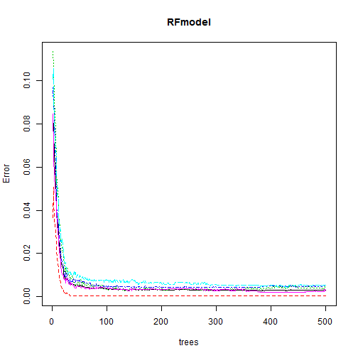
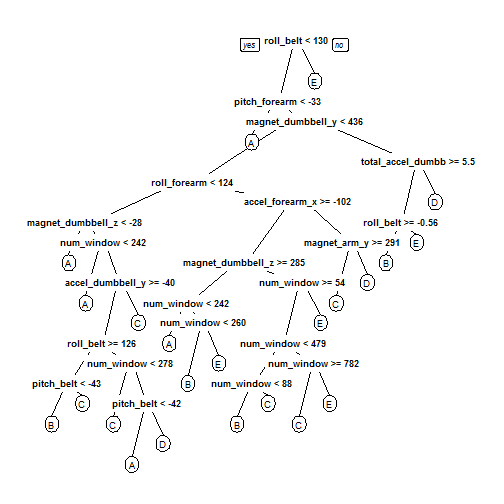
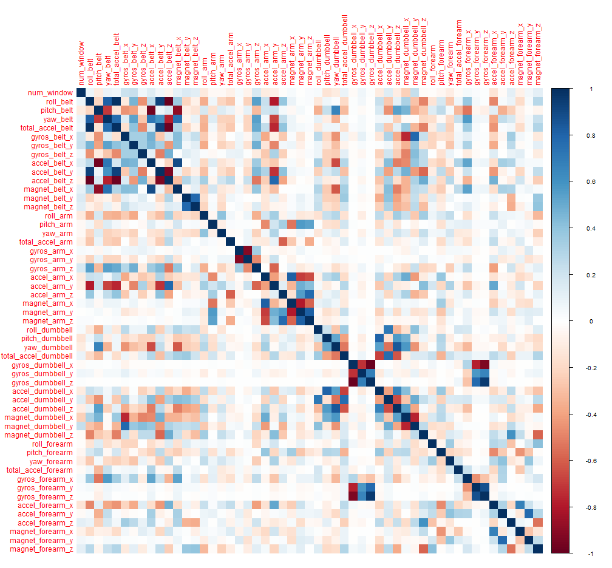

## Human Activity Recognition using Machine Learning Algorithm

   
   
                                **Author : Abas-Hamza**  
                                  
                                  
  
  
  
  
  
* **Abstract**
* **Getting and cleaning the data**
* **Exploration Analysis**
* **Model Building** 
* **Predicting**  
* **Evaluating model accuracy**  

                                  


----------------------------------------------------------------------------------


* Abstract


In this dataset we have 5 classes (sitting-down, standing-up, standing, walking, and sitting) collected on 8 hours of activities of 4 healthy subjects. They were asked to perform barbell lifts correctly and incorrectly in 5 different ways. And the type of devices that are used are part of the quantified self movement or to find patterns in their behaviour. Using devices such as **Jawbone Up** , **Nike FuelBand**, and **Fitbit** are now possible to collect a large amount of data about personal activity relatively inexpensively. The goal of this project is to predict the manner in which they did the exercise. This is the "classe" variable in the training set. This project is part of Human Activity Recognition which has emerged as a key research area in the last decade and now is gaining increasing attention by the pervasive computing research community. In the next section I will Build a pattern recognition model for detecting the type classes which is the target variable that we want to predict by applying different algorithm.  


# Loading required packages


```
## Loading required package: ggplot2
```

```
## Loading required package: caret
```

```
## Loading required package: lattice
```

```
## randomForest 4.6-12
```

```
## Type rfNews() to see new features/changes/bug fixes.
```

```
## 
## Attaching package: 'randomForest'
```

```
## The following object is masked from 'package:ggplot2':
## 
##     margin
```

```
## Loading required package: corrplot
```


# Getting and cleaning the data


The datset has 19622 observations and 160 variables, the target variable That we are interested in is **Class** coded as "A", "B", "C", "D", "E" to indicate exactly according to the specification (Class A), throwing the elbows to the front (Class B), lifting the dumbbell only halfway (Class C), lowering the dumbbell only halfway (Class D) and throwing the hips to the front (Class E) . Class A corresponds to the specified execution of the exercise, while the other 4 classes correspond to common mistakes. This data does have missing values and non-informative variables, We will need to drop  these variables in order to reduce the featur dimension. ID col and and some other variables such as the variable name must be droped from the data. ID variables should always be excluded otherwise it can lead to erroneous analysis. Two models will be tested and The model with the highest accuracy will be chosen as our final model.


```r
# Getting data and summarizing

maindata <- read.csv("pml-training.csv", header = TRUE, stringsAsFactors = FALSE)
validset <- read.csv("pml-testing.csv", header = TRUE, 
stringsAsFactors = FALSE)


# Dealing with NA'S

maindata <- maindata[, colSums(is.na(maindata)) == 0]
dim(maindata)
```

```
## [1] 19622    93
```

```r
# removing non-informative  variables

nearZerovariable <- nearZeroVar(maindata, saveMetrics=TRUE)
maindata <- maindata[,nearZerovariable$nzv ==FALSE]
dim(maindata)
```

```
## [1] 19622    59
```

```r
# cleaning test set

validset <- validset[,colSums(is.na(validset)) == 0]
nearZerovariabletwo <- nearZeroVar(validset, saveMetrics = TRUE)
validset <- validset[,nearZerovariabletwo$nzv ==FALSE]

dim(validset)
```

```
## [1] 20 59
```

```r
# Removing non important variables

maindata <- maindata[-c(1:5)]
validset <- validset[-c(1:5)]
dim(maindata)
```

```
## [1] 19622    54
```

```r
dim(validset)
```

```
## [1] 20 54
```

```r
# Creating trainset and testset

datapartition <- createDataPartition(maindata$classe,
p=0.7, list = FALSE)
traindata <- maindata[datapartition,]
testset <- maindata[-datapartition,]
dim(traindata)
```

```
## [1] 13737    54
```

```r
dim(testset)
```

```
## [1] 5885   54
```

# Model Building

To understand how well our learner performs on unseen dataset we   divide our data into two portions a training dataset and testset.
The training set should be used to build our machine learning model and The test set should be used to see how well our model performs on unseen data. We will now perform KNN using the knn() function in class library.  knn() function forms predictions using a single command. The function requires four inputs:

* A matrix containing the predictors associated with the training data
* A matrix containing the predictors associated with the test data.
* A factor vector containing the class labels for the training data
* An integer for K, indicating he number of nearest neighbors to be used by the classfier.


Before all It is important to normalize all numerical variables because the distance calculation for **k-nn** is dependent on the measurement scale of the predictor variables. 

### Data preparation


```r
# make a function whcih normalize the variable
normalizefunc <- function(x) {
        norma <- (x-min(x)) / (max(x) - min(x)) 
        return(norma)
}

normatrainndata <- as.data.frame(lapply(traindata[1:53], normalizefunc))

normatestdata <- as.data.frame(lapply(testset[1:53],
normalizefunc))


traindata$classe <- as.factor(traindata$classe)
testset$classe <- as.factor(testset$classe)

trainclass <- traindata$classe
testclass <- testset$classe
kvalue <- round(sqrt(nrow(traindata)))
```

Now everything is ready, We've divided the data into training and test, and We've prepared all 4 inputs that we needed to apply for K-NN algorithm. Choosing the value for K doesn't have any limitation, but it is always a good practice to try many diferent values for K. We can try K= 3 or k = square root of n (numbers of the training set). 
Now the knn() function can be used to predict the type of classe.We set a random seed before we apply knn() to ensure reproducibility of results otherwise R will randomly break the tie. 


```r
set.seed(123)
predictionClass <- knn(train =normatrainndata,
test = normatestdata, cl=trainclass, k= kvalue)
```

# Evaluating model accuracy

After We build our model We need a method to evaluate the overall accuracy of the model. This allows us to determine if we have a good or bad model. There are number of ways to determine the accuracy of the model that involves classification. for instance We use the confusion matrix which summarizes the performance of classification. We know that **K-NN** is a lazy learner meaning that it does'nt learn from the trainingset but it actually makes classes and at the same time predict the outcome.


```r
confusionMatrix(predictionClass,testclass)
```

```
## Confusion Matrix and Statistics
## 
##           Reference
## Prediction    A    B    C    D    E
##          A 1361   94   14   34   56
##          B   91  723   90   32   91
##          C  120  180  832  163  131
##          D   83   94   66  696  169
##          E   19   48   24   39  635
## 
## Overall Statistics
##                                         
##                Accuracy : 0.7217        
##                  95% CI : (0.71, 0.7331)
##     No Information Rate : 0.2845        
##     P-Value [Acc > NIR] : < 2.2e-16     
##                                         
##                   Kappa : 0.6494        
##  Mcnemar's Test P-Value : < 2.2e-16     
## 
## Statistics by Class:
## 
##                      Class: A Class: B Class: C Class: D Class: E
## Sensitivity            0.8130   0.6348   0.8109   0.7220   0.5869
## Specificity            0.9530   0.9359   0.8778   0.9163   0.9729
## Pos Pred Value         0.8730   0.7040   0.5835   0.6282   0.8301
## Neg Pred Value         0.9276   0.9144   0.9565   0.9439   0.9127
## Prevalence             0.2845   0.1935   0.1743   0.1638   0.1839
## Detection Rate         0.2313   0.1229   0.1414   0.1183   0.1079
## Detection Prevalence   0.2649   0.1745   0.2423   0.1883   0.1300
## Balanced Accuracy      0.8830   0.7854   0.8443   0.8191   0.7799
```


# Improving the model using Ensembel based Methode

Ensemble based methods are highly superior algorithm offering one of the most convincing way to build highly accurate predictive models. **ensemble methods** use multiple learning algorithms to obtain better predictive performance.
In general an ensemble methods combine the outcome of different models and then select the most appropriate one by voting. **Ensemble based methods** train the same algorithm with different subset of the data. This allows for much more flexible model. In this case we use **Randomforest** With the recommend defaults for each parameter. mtry=sqrt(ncol(x)) and ntree=500.


```r
set.seed(123)
RFmodel <- randomForest(classe~., data = traindata,
importance=TRUE)
print(RFmodel)
```

```
## 
## Call:
##  randomForest(formula = classe ~ ., data = traindata, importance = TRUE) 
##                Type of random forest: classification
##                      Number of trees: 500
## No. of variables tried at each split: 7
## 
##         OOB estimate of  error rate: 0.31%
## Confusion matrix:
##      A    B    C    D    E  class.error
## A 3905    0    0    0    1 0.0002560164
## B    9 2647    2    0    0 0.0041384500
## C    0   11 2384    1    0 0.0050083472
## D    0    0   10 2240    2 0.0053285968
## E    0    0    0    7 2518 0.0027722772
```

```r
rfpred <- predict(RFmodel,testset)
confusionMatrix(rfpred,testclass)
```

```
## Confusion Matrix and Statistics
## 
##           Reference
## Prediction    A    B    C    D    E
##          A 1674    0    0    0    0
##          B    0 1139    8    0    0
##          C    0    0 1018    7    0
##          D    0    0    0  957    2
##          E    0    0    0    0 1080
## 
## Overall Statistics
##                                           
##                Accuracy : 0.9971          
##                  95% CI : (0.9954, 0.9983)
##     No Information Rate : 0.2845          
##     P-Value [Acc > NIR] : < 2.2e-16       
##                                           
##                   Kappa : 0.9963          
##  Mcnemar's Test P-Value : NA              
## 
## Statistics by Class:
## 
##                      Class: A Class: B Class: C Class: D Class: E
## Sensitivity            1.0000   1.0000   0.9922   0.9927   0.9982
## Specificity            1.0000   0.9983   0.9986   0.9996   1.0000
## Pos Pred Value         1.0000   0.9930   0.9932   0.9979   1.0000
## Neg Pred Value         1.0000   1.0000   0.9984   0.9986   0.9996
## Prevalence             0.2845   0.1935   0.1743   0.1638   0.1839
## Detection Rate         0.2845   0.1935   0.1730   0.1626   0.1835
## Detection Prevalence   0.2845   0.1949   0.1742   0.1630   0.1835
## Balanced Accuracy      1.0000   0.9992   0.9954   0.9962   0.9991
```

```r
plot(RFmodel)
```



```r
eos <- 1 - as.numeric(confusionMatrix(rfpred,testclass)$overall[1])
round(eos, digits = 3)
```

```
## [1] 0.003
```

We have got **99.7%** of accuarcy, only 0.003 percent were incorrectly classified by the algorithm. this is huge improvement over **K-NN**. and The expected out-of-sample error is 0.003.

As we know decision tree selects the most homogeneous variables by using metrics such as **information gain**, **Gini ratio** or **Gini index**. Let's take an example and see which variables the tree model selected.


```r
library(rpart)
library(rpart.plot)

rpartmodel <- rpart(classe~., data = traindata,
method = "class")
rpartpred <- predict(rpartmodel, testset,
type="class")
confusionMatrix(rpartpred,testclass)
```

```
## Confusion Matrix and Statistics
## 
##           Reference
## Prediction    A    B    C    D    E
##          A 1504  251   31  103   76
##          B   32  531   40   19   40
##          C   16  209  883  110   25
##          D   88  135   66  675  143
##          E   34   13    6   57  798
## 
## Overall Statistics
##                                           
##                Accuracy : 0.7461          
##                  95% CI : (0.7348, 0.7572)
##     No Information Rate : 0.2845          
##     P-Value [Acc > NIR] : < 2.2e-16       
##                                           
##                   Kappa : 0.6775          
##  Mcnemar's Test P-Value : < 2.2e-16       
## 
## Statistics by Class:
## 
##                      Class: A Class: B Class: C Class: D Class: E
## Sensitivity            0.8984  0.46620   0.8606   0.7002   0.7375
## Specificity            0.8905  0.97240   0.9259   0.9122   0.9771
## Pos Pred Value         0.7654  0.80211   0.7104   0.6098   0.8789
## Neg Pred Value         0.9566  0.88359   0.9692   0.9395   0.9429
## Prevalence             0.2845  0.19354   0.1743   0.1638   0.1839
## Detection Rate         0.2556  0.09023   0.1500   0.1147   0.1356
## Detection Prevalence   0.3339  0.11249   0.2112   0.1881   0.1543
## Balanced Accuracy      0.8945  0.71930   0.8933   0.8062   0.8573
```

```r
prp(rpartmodel)
```




# validationset


```r
set.seed(123)
 
rfpredvali <- predict(RFmodel,validset, type = "class")
print(rfpredvali)
```

```
##  1  2  3  4  5  6  7  8  9 10 11 12 13 14 15 16 17 18 19 20 
##  B  A  B  A  A  E  D  B  A  A  B  C  B  A  E  E  A  B  B  B 
## Levels: A B C D E
```


# Conclusion

In this project I applied **k-NN** algorithm and **RandomForest**. Both are non-parametric classification algorithms that make predictions using the training dataset. That said, **RandomForest** remains robust algorithm and outperforms than **K-NN**.  We've got 99.7% of accuracy and that tells the robustness of random forest amongst other methods . This non parametric approach is widely used when the decision boundary is not highly linear and performs far better than other methods. In this case  the **expected out-of-sample error is 0.003.** meaning that we can choose this model as our final approach.  The dataset had 5 classes (sitting-down, standing-up, standing, walking, and sitting) collected on 8 hours of activities of 4 healthy subjects. The goal was to predict the manner in which they did the exercise. It turns out that our model did very good job correctly predicting almost all cases with less error rate , this suggest that automated machine learning model can be used to answer problems that are based on  Human Activity Recognition. There are many potential applications for HAR, like: elderly monitoring, life log systems for monitoring energy expenditure and for supporting weight-loss programs. I hope that this article covers the practical approach of predicting Human Activity


# Appendix


```r
corrPlot <- cor(traindata[, -length(names(traindata))])
corrplot(corrPlot, method="color")
```



