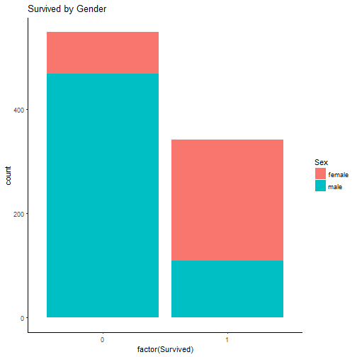
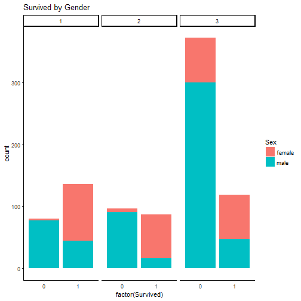
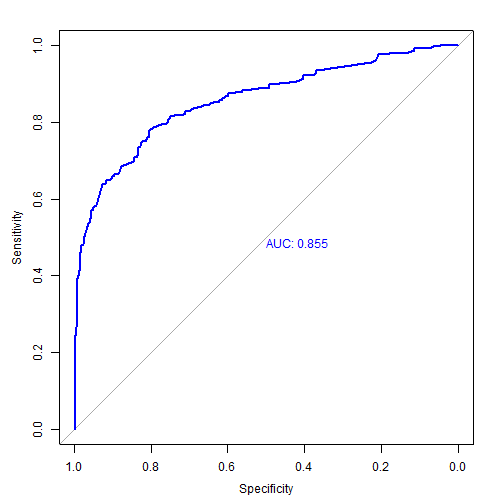

## Titanic Kaggle Competition - Machine Learning


                                  
                                **Author : Abas-Hamza**  
                                  
                                  
  
  
  
  
  
* **Abstract**
* **Getting and cleaning the data**
* **Exploration Analysis**
* **Model Building** 
* **Predicting**  
* **Evaluating model accuracy**  

                              


----------------------------------------------------------------------------------


* Abstract

For the Titanic dataset We have a **classification problem** The response variable is a qualitative variable, which means the variable is indicating whether a specific passenger survived or not. We need to predict of what kind of people were likely to survive from the disaster or did not. The model We are going to use for this specific type of problem is **Logistic Regression**  which is one of the top algorithm We apply for Classification problems. There are many Classification algorithms out there such as **KNN (k-nearest-neighbour) , SVM(Support-vector-Machine), QDA (Quadratic  Discriminant analysis) , and LDA (Linear  Discriminant analysis)** etc...  We can expect that these models to dominate logistic Regression, but We will not perform any cross  validation for this project. In classification problems, we want to develop a model that assigns observations to categories or classes of the response variable. The data We have has been split into two groups: training set (train.csv) and test set (test.csv). The training set should be used to build our machine learning model and The test set should be used to see how well our model performs on unseen data. 


## Getting and cleaning the data. 

1) Loading required packages 


```r
trainingset <- read.csv("train.csv", stringsAsFactors = FALSE)
testset <- read.csv("test.csv", stringsAsFactors = FALSE)
 kable(head(trainingset), align = "c")
```


| PassengerId | Survived | Pclass |                        Name                         |  Sex   | Age | SibSp | Parch |      Ticket      |  Fare   | Cabin | Embarked |
|:-----------:|:--------:|:------:|:---------------------------------------------------:|:------:|:---:|:-----:|:-----:|:----------------:|:-------:|:-----:|:--------:|
|      1      |    0     |   3    |               Braund, Mr. Owen Harris               |  male  | 22  |   1   |   0   |    A/5 21171     | 7.2500  |       |    S     |
|      2      |    1     |   1    | Cumings, Mrs. John Bradley (Florence Briggs Thayer) | female | 38  |   1   |   0   |     PC 17599     | 71.2833 |  C85  |    C     |
|      3      |    1     |   3    |               Heikkinen, Miss. Laina                | female | 26  |   0   |   0   | STON/O2. 3101282 | 7.9250  |       |    S     |
|      4      |    1     |   1    |    Futrelle, Mrs. Jacques Heath (Lily May Peel)     | female | 35  |   1   |   0   |      113803      | 53.1000 | C123  |    S     |
|      5      |    0     |   3    |              Allen, Mr. William Henry               |  male  | 35  |   0   |   0   |      373450      | 8.0500  |       |    S     |
|      6      |    0     |   3    |                  Moran, Mr. James                   |  male  | NA  |   0   |   0   |      330877      | 8.4583  |       |    Q     |

#### Data structure 


```r
summary(trainingset)
```

```
##   PassengerId       Survived          Pclass          Name          
##  Min.   :  1.0   Min.   :0.0000   Min.   :1.000   Length:891        
##  1st Qu.:223.5   1st Qu.:0.0000   1st Qu.:2.000   Class :character  
##  Median :446.0   Median :0.0000   Median :3.000   Mode  :character  
##  Mean   :446.0   Mean   :0.3838   Mean   :2.309                     
##  3rd Qu.:668.5   3rd Qu.:1.0000   3rd Qu.:3.000                     
##  Max.   :891.0   Max.   :1.0000   Max.   :3.000                     
##                                                                     
##      Sex                 Age            SibSp           Parch       
##  Length:891         Min.   : 0.42   Min.   :0.000   Min.   :0.0000  
##  Class :character   1st Qu.:20.12   1st Qu.:0.000   1st Qu.:0.0000  
##  Mode  :character   Median :28.00   Median :0.000   Median :0.0000  
##                     Mean   :29.70   Mean   :0.523   Mean   :0.3816  
##                     3rd Qu.:38.00   3rd Qu.:1.000   3rd Qu.:0.0000  
##                     Max.   :80.00   Max.   :8.000   Max.   :6.0000  
##                     NA's   :177                                     
##     Ticket               Fare           Cabin             Embarked        
##  Length:891         Min.   :  0.00   Length:891         Length:891        
##  Class :character   1st Qu.:  7.91   Class :character   Class :character  
##  Mode  :character   Median : 14.45   Mode  :character   Mode  :character  
##                     Mean   : 32.20                                        
##                     3rd Qu.: 31.00                                        
##                     Max.   :512.33                                        
## 
```

```r
str(trainingset)
```

```
## 'data.frame':	891 obs. of  12 variables:
##  $ PassengerId: int  1 2 3 4 5 6 7 8 9 10 ...
##  $ Survived   : int  0 1 1 1 0 0 0 0 1 1 ...
##  $ Pclass     : int  3 1 3 1 3 3 1 3 3 2 ...
##  $ Name       : chr  "Braund, Mr. Owen Harris" "Cumings, Mrs. John Bradley (Florence Briggs Thayer)" "Heikkinen, Miss. Laina" "Futrelle, Mrs. Jacques Heath (Lily May Peel)" ...
##  $ Sex        : chr  "male" "female" "female" "female" ...
##  $ Age        : num  22 38 26 35 35 NA 54 2 27 14 ...
##  $ SibSp      : int  1 1 0 1 0 0 0 3 0 1 ...
##  $ Parch      : int  0 0 0 0 0 0 0 1 2 0 ...
##  $ Ticket     : chr  "A/5 21171" "PC 17599" "STON/O2. 3101282" "113803" ...
##  $ Fare       : num  7.25 71.28 7.92 53.1 8.05 ...
##  $ Cabin      : chr  "" "C85" "" "C123" ...
##  $ Embarked   : chr  "S" "C" "S" "S" ...
```


```r
dim(trainingset)
```

```
## [1] 891  12
```

```r
dim(testset)
```

```
## [1] 418  11
```

The training set has 891 observations and 12 variables and the testing set has 418 observations and 11 variables. We know that in test data we are missing the dichotomous variable Survival, because that is our challenge, we must predict that missing variable by creating a model.
We need to clean the training data befor training our model, In training data there are Unnecessary variables , We will leave out these variables as We move forward. 

### Dealing With Missing Values


```r
missingdata <- colSums(is.na(trainingset))
missingdata1 <- as.data.frame(missingdata)


kable(missingdata1, align = "c", caption = "NA's by variables")
```


|            | missingdata |
|:-----------|:-----------:|
|PassengerId |      0      |
|Survived    |      0      |
|Pclass      |      0      |
|Name        |      0      |
|Sex         |      0      |
|Age         |     177     |
|SibSp       |      0      |
|Parch       |      0      |
|Ticket      |      0      |
|Fare        |      0      |
|Cabin       |      0      |
|Embarked    |      0      |

There are 177 missing values in the variable age, Let's fixe it


```r
agemean <- mean(trainingset$Age, na.rm = TRUE)
rounded_mean <- round(agemean)
trainingset[is.na(trainingset$Age), "Age"] <- rounded_mean

class(trainingset$Age)
```

```
## [1] "numeric"
```


## Exploration  Analysis. 

Let's concentrate first on the relationship between Sex and survival.


```r
plot1 <- ggplot(trainingset, aes(x =factor(Survived), fill=Sex)) +  
         geom_bar() +
         ggtitle("Survived by Gender") + 
         theme_classic()
         
plot1
```



check it out how many passengers that survived vs did not and Survived by gender Vs did not .


```r
table(trainingset$Survived)
```

```
## 
##   0   1 
## 549 342
```

```r
table(trainingset$Sex,trainingset$Survived)
```

```
##         
##            0   1
##   female  81 233
##   male   468 109
```

```r
 proportion <- prop.table(table(trainingset$Sex,
              trainingset$Survived),margin = 1)
```

As We can see there are 342 out of 891 who survived most of them are females. The graph below shows the number of Survived VS not Survived by Passenger Class (1 = 1st; 2 = 2nd; 3 = 3rd) and gender. There are more men who died than Women in all Passenger's Classes and more Women who survived than men.  


```r
plot2 <- ggplot(trainingset, aes(x =factor(Survived), fill=Sex))         +  
         geom_bar() + facet_grid(.~Pclass) +
         ggtitle("Survived by Gender") + 
         theme_classic()
         
plot2
```



## Model Building

The model We are going to build is logistic regression, logistic regression models the probability that  **Y** belongs to a particular categories. In this case our Y is **Survived** variable. We need to model the functional form to prevent values from exceeding [0,1]. in order to maintain the probability within the expected range We use the **logistic function** and P(X) will never decrease below 0 and never exceed 1.


#### Multiple predictors

logistic regression handles multiple predictors in the form:


#### Cleaning the Training Data

There are unnecessary variables that We need to leave out before building our model. 


```r
trainingsetdata <- trainingset[-c(1,4,9,11)]
names(trainingsetdata)
```

```
## [1] "Survived" "Pclass"   "Sex"      "Age"      "SibSp"    "Parch"   
## [7] "Fare"     "Embarked"
```

```r
trainingsetdata$Sex <- ifelse(trainingsetdata$Sex == "female", 1, 0)

ModelTrain <- glm(formula = Survived~.,  family =binomial, data = trainingsetdata)

summary(ModelTrain)
```

```
## 
## Call:
## glm(formula = Survived ~ ., family = binomial, data = trainingsetdata)
## 
## Deviance Residuals: 
##     Min       1Q   Median       3Q      Max  
## -2.6454  -0.5914  -0.4222   0.6224   2.4428  
## 
## Coefficients:
##               Estimate Std. Error z value Pr(>|z|)    
## (Intercept)  14.859019 610.184159   0.024   0.9806    
## Pclass       -1.100165   0.143522  -7.665 1.78e-14 ***
## Sex           2.718480   0.200803  13.538  < 2e-16 ***
## Age          -0.039978   0.007854  -5.090 3.57e-07 ***
## SibSp        -0.326001   0.109467  -2.978   0.0029 ** 
## Parch        -0.093296   0.118741  -0.786   0.4320    
## Fare          0.001915   0.002376   0.806   0.4204    
## EmbarkedC   -12.286512 610.183962  -0.020   0.9839    
## EmbarkedQ   -12.315486 610.184013  -0.020   0.9839    
## EmbarkedS   -12.706672 610.183946  -0.021   0.9834    
## ---
## Signif. codes:  0 '***' 0.001 '**' 0.01 '*' 0.05 '.' 0.1 ' ' 1
## 
## (Dispersion parameter for binomial family taken to be 1)
## 
##     Null deviance: 1186.66  on 890  degrees of freedom
## Residual deviance:  784.07  on 881  degrees of freedom
## AIC: 804.07
## 
## Number of Fisher Scoring iterations: 13
```

#### Improving The model

The level of statistical significance is often expressed as the so-called p.value. We need to add all variables which have low p-value in our model and leave out those who do not. Because adding variables which do not contribute to the model may influence how We interpret the coefficient of the model. In this case variables **Embarked,Parch and Fare** have the highest P-values, We will leave out these variables and see if that is associated an improvement in the model.The good thing in Logistic regression is that it tells you which predictors are important On the other hand, **KNN,SVM or RF** do not tell us which predictors are important. 


```r
ModelTrain <- glm(formula = Survived~ Age+Sex+Pclass+SibSp,  family =binomial, data = trainingsetdata)

summary(ModelTrain)
```

```
## 
## Call:
## glm(formula = Survived ~ Age + Sex + Pclass + SibSp, family = binomial, 
##     data = trainingsetdata)
## 
## Deviance Residuals: 
##     Min       1Q   Median       3Q      Max  
## -2.6875  -0.6060  -0.4172   0.6107   2.4585  
## 
## Coefficients:
##              Estimate Std. Error z value Pr(>|z|)    
## (Intercept)  2.453594   0.424320   5.782 7.36e-09 ***
## Age         -0.039809   0.007751  -5.136 2.81e-07 ***
## Sex          2.739862   0.194168  14.111  < 2e-16 ***
## Pclass      -1.171663   0.119657  -9.792  < 2e-16 ***
## SibSp       -0.358311   0.104140  -3.441  0.00058 ***
## ---
## Signif. codes:  0 '***' 0.001 '**' 0.01 '*' 0.05 '.' 0.1 ' ' 1
## 
## (Dispersion parameter for binomial family taken to be 1)
## 
##     Null deviance: 1186.66  on 890  degrees of freedom
## Residual deviance:  790.79  on 886  degrees of freedom
## AIC: 800.79
## 
## Number of Fisher Scoring iterations: 5
```

Apparently the model improved, all predictors are statistically significant, they do contribute to model, Next We will examine how accurate our model will be on unseen dataset. The smallest p-value here is associated with Passenger Class and Sex variables. for every one-unit increase in Passenger Class, we expect the log-odds of survival to decrease by 1.17 and for every one-unit increase in age, we expect the log-odds of survival to decrease by 0.039. 

#### Cleaning the Test Data


```r
missingtest_data <- colSums(is.na(testset))
kable(as.data.frame(missingtest_data), align = "c")
```


|            | missingtest_data |
|:-----------|:----------------:|
|PassengerId |        0         |
|Pclass      |        0         |
|Name        |        0         |
|Sex         |        0         |
|Age         |        86        |
|SibSp       |        0         |
|Parch       |        0         |
|Ticket      |        0         |
|Fare        |        1         |
|Cabin       |        0         |
|Embarked    |        0         |

```r
PassengerId <- testset[1]
testset$Sex <- ifelse(testset$Sex == "female", 1, 0)
testset[is.na(testset$Age), "Age"] <- round(mean(trainingset$Age, na.rm = TRUE))

testset <- testset[-c(1,3,7,8,9,10,11)]

names(testset)
```

```
## [1] "Pclass" "Sex"    "Age"    "SibSp"
```

# Predicting 
We have build our model, now our model is ready to be applied.


```r
predictModel <- predict.glm( ModelTrain, newdata = testset , type = "response")

survival <- ifelse( predictModel > 0.5, 1,0)

# Creating CSV for Kaggle Submission

Submit <- cbind(PassengerId,survival)
colnames(Submit) <- c("PassengerId", "Survived")

write.csv(Submit, file ="titanic.csv", row.names = FALSE)
```

# Evaluating model accuracy.

After We build our model We need a method to evaluate the overall accuracy of the model. This allows us to determine if we have a good or bad model. There are number of ways to determine the accuracy of the model that involves classification such as logistic Regression. 
Bear in mind that Binary classifiers such as logistic regression make two types of error the False positive and the False negative, We want to understand how our model distinguishes these two types. In this case False positive means predict an individual survived the Titanic, when in fact the individual died. And False negative means - predict an individual died on the Titanic, when in fact the individual survived. 
ROC (Receiver operating characteristic )
A receiver operating characteristic (ROC) curve quantifies the overall performance of the Classification test. It is also an alternative graphical method for comparing the types of errors . The ROC curve plots the true positive rate vs the false positive rate  which is **(Sensitivity VS 1- specificity)**. There is a trade-off between Specificity and sensitivity. If you increase one the other decreases. For ex : If you make the threshold high, you won't mistakenly predict the Survive in many who didn't  survive , but you will miss some of the people who have Survived. And if you make the threshold low, you'll correctly identify all (or almost all) of the people who survived, but will also predict survived in more people who didn't . The overall performance of the classifier across all potential thresholds is the **area under the (ROC) curve ** (AUC). The good AUC curve hugs the top left corner of the graph, so a larger AUC indicates a better classifier. An AUC of 1 tells perfect prediction. The dashed line represents the null model where we randomly guess whether individuals are survivors or dead, this gives us a picture of the whole spectrum of such trade-off.


```r
rocurve <- roc(trainingsetdata$Survived ~ predict.glm(ModelTrain, newdata = trainingsetdata,
type = "response"))
auc(rocurve)
```

```
## Area under the curve: 0.8551
```

```r
plot.roc(rocurve,print.auc = TRUE, col="blue")
```



The area under the ROC curve (AUC) can be summarised by computing the trapezoidal rule where i's are the thresholds where the curve is computed


### confusion matrix

Calculating a confusion matrix can give you a better idea of what your classification model is getting right and what types of errors it is making. This technique summarizes the performance of a classification algorithm. Classification accuracy is the ratio of correct predictions to total predictions made


```r
predictz <- predict.glm(ModelTrain, newdata = trainingsetdata, type ="response")

predictz2 <- ifelse(predictz > 0.5,1,0)

confusionMat <- confusionMatrix(trainingsetdata$Survived,predictz2)
confusionMat
```

```
## Confusion Matrix and Statistics
## 
##           Reference
## Prediction   0   1
##          0 458  91
##          1  98 244
##                                           
##                Accuracy : 0.7879          
##                  95% CI : (0.7595, 0.8143)
##     No Information Rate : 0.624           
##     P-Value [Acc > NIR] : <2e-16          
##                                           
##                   Kappa : 0.5498          
##  Mcnemar's Test P-Value : 0.6625          
##                                           
##             Sensitivity : 0.8237          
##             Specificity : 0.7284          
##          Pos Pred Value : 0.8342          
##          Neg Pred Value : 0.7135          
##              Prevalence : 0.6240          
##          Detection Rate : 0.5140          
##    Detection Prevalence : 0.6162          
##       Balanced Accuracy : 0.7760          
##                                           
##        'Positive' Class : 0               
## 
```

```r
table(predictz2)
```

```
## predictz2
##   0   1 
## 556 335
```


```r
predictz3 <- ifelse(predictz > 0.5,"Up","Down")
table(predictz3,trainingsetdata$Survived)
```

```
##          
## predictz3   0   1
##      Down 458  98
##      Up    91 244
```

```r
mean(predictz2 == trainingsetdata$Survived)
```

```
## [1] 0.7878788
```

```r
mean(predictz2 != trainingsetdata$Survived)
```

```
## [1] 0.2121212
```

The mean() function is used to compute the fraction for which the prediction was correct. Another word, is the ratio of correct predictions to total predictions made. In this case, the model correctly predicted 78% of the time. However, this result could be misleading because we trained and tested the model on the same set. 100 - 78% is the percent of mismatch of the model, in this case we call the training error rate since We did'nt use the testset. to better assess the accuracy of the model in this setting, we could have fit the model using part of the data (testset), and then examine how well the modele predicts, because doing so will yield a more realistic error rate, but Unfortunately we are missing the observed dichotomous variable in the test set. 
The diagonal elements of the confusion matrix indicate correct predictions, while the off-diagonals represent incorrect predictions. In this case our model correctly predicted as Survived on 244 cases and that it would not Survived on 458 cases, for a total of 244 + 458 = 702 correct predictions.


### Hosmer-Lemeshow Test

Hosmer-Lemeshow test examines whether the observed proportion of events are similar to the predicted probabilities of occurences in subgroups of the dataset using a pearson chi-square statistic.  It is used frequently in risk prediction models. Small values with large p-values indicate a good fit and large values with p-values below **0.5** indicate a poor fit.for Hosmer-Lemeshow test The null hypothesis holds that the model fits the data. 

The Hosmer-Lemeshow test statistic is evaluated by the following formula :


```r
hlt <- HLgof.test(fit = fitted(ModelTrain), obs = trainingsetdata$Survived)
hlt
```

```
## $C
## 
## 	Hosmer-Lemeshow C statistic
## 
## data:  fitted(ModelTrain) and trainingsetdata$Survived
## X-squared = 23.583, df = 8, p-value = 0.002691
## 
## 
## $H
## 
## 	Hosmer-Lemeshow H statistic
## 
## data:  fitted(ModelTrain) and trainingsetdata$Survived
## X-squared = 28.543, df = 8, p-value = 0.0003813
```

### Variable Importance


To evaluate the importance of individual predictors in the model, we use the VarImp() function in carret package and see the absolute value of the t-statistic for each model parameter.The t-statistic helps us determine if it's significantly different from zero.


```r
varImp(ModelTrain)
```

```
##          Overall
## Age     5.135897
## Sex    14.110759
## Pclass  9.791817
## SibSp   3.440671
```


###  Goodness of Fit McFadden (Pseudo R2)

In linear regression Rsquare Was the percent of variations in y explained by the model, but in logistic things are different, We no longer have Rsquare instead we have Pseudo R2. pseudo-R2 statistics are often based on relating the loglikelihood of the current model against that of the null model (intercept only). One of the most popular pseudo-R2 is McFadden's R.  The measuring range of McFadden's R is from 0 to 1, with values closer to zero indicating that the model fit porly.


```r
pR2(ModelTrain)
```

```
##          llh      llhNull           G2     McFadden         r2ML 
## -395.3974268 -593.3275684  395.8602833    0.3335934    0.3587191 
##         r2CU 
##    0.4873869
```


