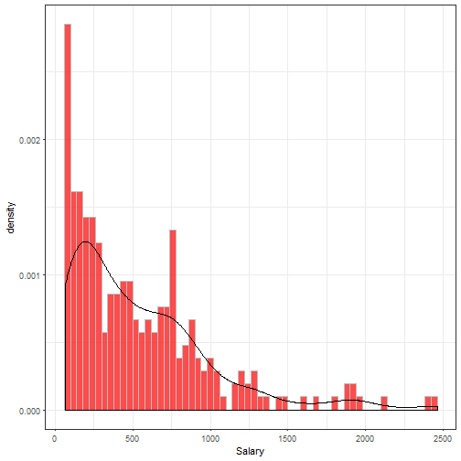
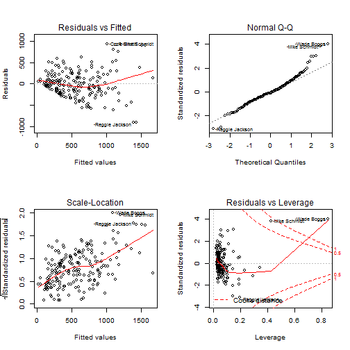
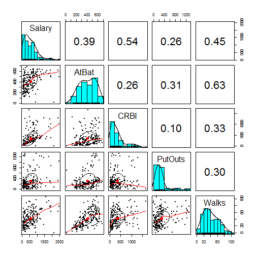
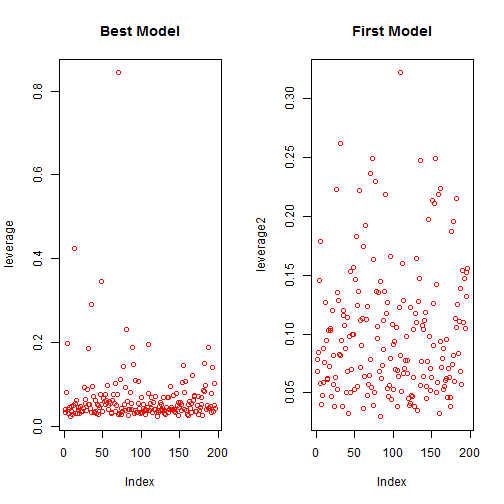
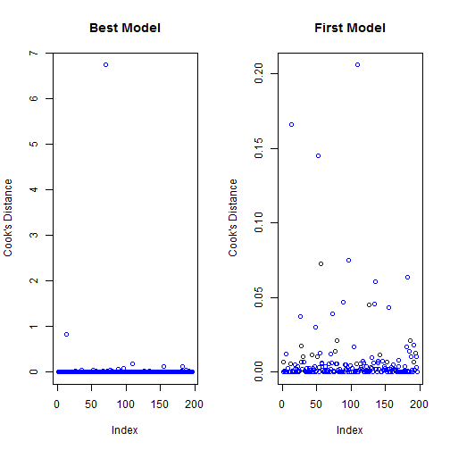

# Tuning Machine Learning Algorithm


                                  
                                **Author : Abas-Hamza**  
                                  
                                  
  
  
  
* **Abstract**
* **Getting and cleaning the data**
* **Exploration Analysis**
* **Model Building** 
* **Predicting**  
* **Evaluating model accuracy**  

                              


----------------------------------------------------------------------------------


* Abstract


Model tuning is substantially required whether the target variable is qualitative or quantitative. It is considered a highly profitable approach for predictive modelling. Having that in mind at first hand, We may avoid having in our model things like **Multicollinearity, Redundancy,Over fitting, Under-fitting, Outliers, high leverage and high-dimensionality**. Theses are known factors affecting the overall quality of the model particularly in regression model.  To make it concrete, I am going to define each of them and later on A theoretical consideration and practical approach. Let's start first with **multicollinearity**. Multicollinearity refers to a situation where a number of independent variables in a model are closely correlated to one another particularly in multiple regression model . This can lead to a less reliable model and redundancy. Now that We know the effects that multicollinearity can have on the model, how can We detect it's presence in the model? Well that is what I'm going to cover for next lines. One of the most common  ways of eliminating the problem of multicollinearity is to identify the collinear variables and removing them. We can use correlation matrix amongst  variables. Another way is measuring the Variance Inflation Factors.   Variance Inflation Factors **VIF** quantifies the degree of multicollinearity and measures how much the variance of an estimated regression coefficient is increased because of collinearity. The Following formula is computed for **VIF**  where R2i is the coefficient of determination of the regression equation :


The goal of a good  model is to capture patterns well from the training data that would allows us to make predictions in the future on data the model has never seen. During building model the two mature problems that may occur are **over-fitting** and **under-fitting**. **Over-fitting** is a modelling error, it occurs when the model is describing the noise (Random error) instead of the underlying  relationship. This occurs when a model is excessively complex as a result the model has poor predictive performance. **Under-fitting** refers when the model is not capturing the underlying relationship  of the data. This modelling error occurs  when we fit a linear model to a non linear data, thus the performance of such model is extremely poor. There are some important techniques that we can use to limit over-fitting such as k-fold cross validation and bootstrapping. The other things that I want mention are outliers and high leverage point.  **outlier** is an observation point that is distant from other observations. It is also a data point whose response y does not follow the general trend of the data . **Outlier** may indicate experimental error, these errors are excluded from the dataset. There is no mathematical definition which determines whether or not an observation is an outlier , but There are various methods of outlier detection . Some are graphical such as Residual plot, and cooks-distance. A data point has high leverage if the predictors variable is extremely far away from it's mean. The further the data point is away form it's mean the higher leverage. Outliers and high leverage data points are considered  to be influential, but we have to investigate further to determine whether or not they are actually influential. One general approach widely used to measure influential point is **cook's-distance** or **Cook's-D**. Cook's distance can be used to indicate influential data points that are particularly worth checking, the goal is to detect highly influential observations.  
The Following formula is computed for **COOK'S D**  where **hii** is the leverage point:


Now that We have a fair understanding about the concept of model tuning. Let's get hands dirty, I'm going to analyse the Major League Baseball Data from the 1986 and 1987 seasons (Hitters) using Multiple Regression Model and all the techniques I've mentioned so far . The data can be found in the ISLR package. The following data has 322 observations of major league players and 20 variables . 


# Getting and cleaning the data


```
## Loading required package: ggplot2
```

```
## Loading required package: caret
```

```
## Loading required package: lattice
```

```
## Loading required package: MASS
```

```
## Classes and Methods for R developed in the
```

```
## Political Science Computational Laboratory
```

```
## Department of Political Science
```

```
## Stanford University
```

```
## Simon Jackman
```

```
## hurdle and zeroinfl functions by Achim Zeileis
```

```
## 
## Attaching package: 'dplyr'
```

```
## The following object is masked from 'package:MASS':
## 
##     select
```

```
## The following objects are masked from 'package:stats':
## 
##     filter, lag
```

```
## The following objects are masked from 'package:base':
## 
##     intersect, setdiff, setequal, union
```

```
## 
## Attaching package: 'psych'
```

```
## The following objects are masked from 'package:ggplot2':
## 
##     %+%, alpha
```

```r
data(Hitters)
maindata <- Hitters
summary(maindata)
```

```
##      AtBat            Hits         HmRun            Runs       
##  Min.   : 16.0   Min.   :  1   Min.   : 0.00   Min.   :  0.00  
##  1st Qu.:255.2   1st Qu.: 64   1st Qu.: 4.00   1st Qu.: 30.25  
##  Median :379.5   Median : 96   Median : 8.00   Median : 48.00  
##  Mean   :380.9   Mean   :101   Mean   :10.77   Mean   : 50.91  
##  3rd Qu.:512.0   3rd Qu.:137   3rd Qu.:16.00   3rd Qu.: 69.00  
##  Max.   :687.0   Max.   :238   Max.   :40.00   Max.   :130.00  
##                                                                
##       RBI             Walks            Years            CAtBat       
##  Min.   :  0.00   Min.   :  0.00   Min.   : 1.000   Min.   :   19.0  
##  1st Qu.: 28.00   1st Qu.: 22.00   1st Qu.: 4.000   1st Qu.:  816.8  
##  Median : 44.00   Median : 35.00   Median : 6.000   Median : 1928.0  
##  Mean   : 48.03   Mean   : 38.74   Mean   : 7.444   Mean   : 2648.7  
##  3rd Qu.: 64.75   3rd Qu.: 53.00   3rd Qu.:11.000   3rd Qu.: 3924.2  
##  Max.   :121.00   Max.   :105.00   Max.   :24.000   Max.   :14053.0  
##                                                                      
##      CHits            CHmRun           CRuns             CRBI        
##  Min.   :   4.0   Min.   :  0.00   Min.   :   1.0   Min.   :   0.00  
##  1st Qu.: 209.0   1st Qu.: 14.00   1st Qu.: 100.2   1st Qu.:  88.75  
##  Median : 508.0   Median : 37.50   Median : 247.0   Median : 220.50  
##  Mean   : 717.6   Mean   : 69.49   Mean   : 358.8   Mean   : 330.12  
##  3rd Qu.:1059.2   3rd Qu.: 90.00   3rd Qu.: 526.2   3rd Qu.: 426.25  
##  Max.   :4256.0   Max.   :548.00   Max.   :2165.0   Max.   :1659.00  
##                                                                      
##      CWalks        League  Division    PutOuts          Assists     
##  Min.   :   0.00   A:175   E:157    Min.   :   0.0   Min.   :  0.0  
##  1st Qu.:  67.25   N:147   W:165    1st Qu.: 109.2   1st Qu.:  7.0  
##  Median : 170.50                    Median : 212.0   Median : 39.5  
##  Mean   : 260.24                    Mean   : 288.9   Mean   :106.9  
##  3rd Qu.: 339.25                    3rd Qu.: 325.0   3rd Qu.:166.0  
##  Max.   :1566.00                    Max.   :1378.0   Max.   :492.0  
##                                                                     
##      Errors          Salary       NewLeague
##  Min.   : 0.00   Min.   :  67.5   A:176    
##  1st Qu.: 3.00   1st Qu.: 190.0   N:146    
##  Median : 6.00   Median : 425.0            
##  Mean   : 8.04   Mean   : 535.9            
##  3rd Qu.:11.00   3rd Qu.: 750.0            
##  Max.   :32.00   Max.   :2460.0            
##                  NA's   :59
```

```r
str(maindata)
```

```
## 'data.frame':	322 obs. of  20 variables:
##  $ AtBat    : int  293 315 479 496 321 594 185 298 323 401 ...
##  $ Hits     : int  66 81 130 141 87 169 37 73 81 92 ...
##  $ HmRun    : int  1 7 18 20 10 4 1 0 6 17 ...
##  $ Runs     : int  30 24 66 65 39 74 23 24 26 49 ...
##  $ RBI      : int  29 38 72 78 42 51 8 24 32 66 ...
##  $ Walks    : int  14 39 76 37 30 35 21 7 8 65 ...
##  $ Years    : int  1 14 3 11 2 11 2 3 2 13 ...
##  $ CAtBat   : int  293 3449 1624 5628 396 4408 214 509 341 5206 ...
##  $ CHits    : int  66 835 457 1575 101 1133 42 108 86 1332 ...
##  $ CHmRun   : int  1 69 63 225 12 19 1 0 6 253 ...
##  $ CRuns    : int  30 321 224 828 48 501 30 41 32 784 ...
##  $ CRBI     : int  29 414 266 838 46 336 9 37 34 890 ...
##  $ CWalks   : int  14 375 263 354 33 194 24 12 8 866 ...
##  $ League   : Factor w/ 2 levels "A","N": 1 2 1 2 2 1 2 1 2 1 ...
##  $ Division : Factor w/ 2 levels "E","W": 1 2 2 1 1 2 1 2 2 1 ...
##  $ PutOuts  : int  446 632 880 200 805 282 76 121 143 0 ...
##  $ Assists  : int  33 43 82 11 40 421 127 283 290 0 ...
##  $ Errors   : int  20 10 14 3 4 25 7 9 19 0 ...
##  $ Salary   : num  NA 475 480 500 91.5 750 70 100 75 1100 ...
##  $ NewLeague: Factor w/ 2 levels "A","N": 1 2 1 2 2 1 1 1 2 1 ...
```

```r
dim(maindata)
```

```
## [1] 322  20
```
The datset has 322 observations and 20 variables, the target variable That we are interested in is **Salary**, Before I divide the data into 2 parts train and test, I like to clean the overall dataset at once. There are 59 missing values in Salary.   


```r
maindata <- na.omit(maindata)
# No missing values now
dim(maindata)
```

```
## [1] 263  20
```
Now the data in hand has no missing value. 

#### dividing data into sets. 

The training set should be used to build our machine learning model and The test set should be used to see how well our model performs on unseen data.


```r
set.seed(1)
samplesize <- floor(0.75* nrow(maindata))

sampledata <- sample.int(n=nrow(maindata), size = samplesize, replace = FALSE)
traindata <- maindata[sampledata,]
testset <- maindata[-sampledata,]
```


# Exploration Analysis


```r
plot1 <- ggplot(data = maindata, aes(x=Salary, y=..density..))+
geom_histogram( fill="red", alpha=0.7,col="grey", binwidth = 40 ) +
geom_density() + theme_bw()

plot1
```



Most salary fall into [ 100,500] interval. the data is not normally distributed as many statistician would like to see often or assume a normally distributed data, but in real-world the data is messy.  There are many variables and we don't actually understand how these variable are related to the target variable, another word we don't know yet how to interpret these variables, whether  they contribute to the model or not. In the next section we will explore the most appropriate techniques to identify useful variables that we may include in our model. 

# Model building


To build a regression model , it's highly important to consider variable selection, it turns out that variables are the key components which contribute to overall quality of the model. Variable selection is intended to select the best **predictors** that may contribute to the model . Apparently  Unnecessary variables or features tend to add noise to the model and will not provide any relevant information. There are various approaches to select the best **features** such as **Stepwise Procedures, Forward Selection and Criterion based Selection**.  There are advantages and disadvantage for each approach.  For instance I do consider the first approach which is the simplest of all variable selection procedures and can be easily implemented. It all start with all **Features** in the model , remove the **features** with highest **P-Value** and then refit the model until We get fewer variables which really contribute to the model.   We can use Covariance Matrix plot To identify collinear variables, however since we have 20 variables, there will be  **p(1-p) / 2** scatter-plots, but that is really huge and time consuming process. It also not realistic to analyse an unlimited scatter-plots. One way to tackle this problem consists reducing the high-dimensional space to a space of fewer dimensions by only extracting important **features**. Reducing high-dimensional data using Principal Component Analysis **PCA** is very beneficial and reliable. We now perform best subset selection by identifying the best model that contains a given number of predictors. 


```r
fitmodel <- lm(Salary~., data = traindata)

# This function returns all variables with lowest P-vALUES
lowestPvalue <- function(x) {
        
       coefsum <- summary(x)$coefficient[,4]
       lowestval <- coefsum < 0.05
       dataframe <- as.data.frame(lowestval)
       bestvar <- subset(dataframe, lowestval == "TRUE")
       viewdata <- kable(bestvar, align = "c", caption = 
         "Variables With Lowest P-vALUES")
       return(viewdata)
       
        
}
lowestPvalue(fitmodel)
```


|            | lowestval |
|:-----------|:---------:|
|(Intercept) |   TRUE    |
|Walks       |   TRUE    |
|DivisionW   |   TRUE    |
|PutOuts     |   TRUE    |


The R2 in the model above  is 0.53, as expected we know that R2 statistic tends to increase monotonically as more variables are included. That suggests that it is misleading to select a model based on R2 statistic. We then select best subset.
 


```r
summary(fitmodel)
```

```
## 
## Call:
## lm(formula = Salary ~ ., data = traindata)
## 
## Residuals:
##     Min      1Q  Median      3Q     Max 
## -808.33 -188.40  -35.91  142.41 1788.54 
## 
## Coefficients:
##               Estimate Std. Error t value Pr(>|t|)   
## (Intercept)  278.15504  111.57760   2.493  0.01359 * 
## AtBat         -1.63311    0.83511  -1.956  0.05209 . 
## Hits           4.09724    3.12133   1.313  0.19100   
## HmRun          0.06910    7.81227   0.009  0.99295   
## Runs          -1.68450    3.67636  -0.458  0.64737   
## RBI            1.86122    3.33698   0.558  0.57772   
## Walks          6.61171    2.30091   2.874  0.00456 **
## Years        -22.41104   15.74081  -1.424  0.15628   
## CAtBat        -0.23969    0.17193  -1.394  0.16502   
## CHits          0.90788    0.86531   1.049  0.29552   
## CHmRun         0.97655    1.89967   0.514  0.60785   
## CRuns          1.60496    0.93102   1.724  0.08648 . 
## CRBI          -0.35481    0.88152  -0.402  0.68781   
## CWalks        -0.81246    0.42567  -1.909  0.05792 . 
## LeagueN       82.67945   89.85757   0.920  0.35876   
## DivisionW   -144.71328   50.29718  -2.877  0.00451 **
## PutOuts        0.24764    0.09378   2.641  0.00902 **
## Assists        0.22267    0.26648   0.836  0.40451   
## Errors        -1.27302    5.18057  -0.246  0.80618   
## NewLeagueN   -13.51661   89.27369  -0.151  0.87983   
## ---
## Signif. codes:  0 '***' 0.001 '**' 0.01 '*' 0.05 '.' 0.1 ' ' 1
## 
## Residual standard error: 333.6 on 177 degrees of freedom
## Multiple R-squared:  0.536,	Adjusted R-squared:  0.4862 
## F-statistic: 10.76 on 19 and 177 DF,  p-value: < 2.2e-16
```

```r
fitmodel2 <- lm(Salary~AtBat+CRBI+PutOuts+Division+poly(Walks,5)+poly(Hits,3), data = traindata)
summary(fitmodel2)
```

```
## 
## Call:
## lm(formula = Salary ~ AtBat + CRBI + PutOuts + Division + poly(Walks, 
##     5) + poly(Hits, 3), data = traindata)
## 
## Residuals:
##     Min      1Q  Median      3Q     Max 
## -904.46 -188.41  -34.44  163.47  934.50 
## 
## Coefficients:
##                   Estimate Std. Error t value Pr(>|t|)    
## (Intercept)      9.092e+02  3.009e+02   3.022 0.002869 ** 
## AtBat           -1.225e+00  7.402e-01  -1.655 0.099600 .  
## CRBI             5.922e-01  7.386e-02   8.019 1.21e-13 ***
## PutOuts          1.275e-01  8.640e-02   1.476 0.141721    
## DivisionW       -1.623e+02  4.710e+01  -3.447 0.000703 ***
## poly(Walks, 5)1  1.122e+03  4.557e+02   2.462 0.014727 *  
## poly(Walks, 5)2  7.149e+02  3.803e+02   1.880 0.061692 .  
## poly(Walks, 5)3 -4.216e+02  3.822e+02  -1.103 0.271393    
## poly(Walks, 5)4 -1.007e+01  3.460e+02  -0.029 0.976826    
## poly(Walks, 5)5 -1.459e+02  3.502e+02  -0.417 0.677380    
## poly(Hits, 3)1   3.773e+03  1.519e+03   2.485 0.013854 *  
## poly(Hits, 3)2   6.726e+02  4.178e+02   1.610 0.109204    
## poly(Hits, 3)3  -1.315e+03  4.110e+02  -3.198 0.001629 ** 
## ---
## Signif. codes:  0 '***' 0.001 '**' 0.01 '*' 0.05 '.' 0.1 ' ' 1
## 
## Residual standard error: 321.3 on 184 degrees of freedom
## Multiple R-squared:  0.5525,	Adjusted R-squared:  0.5233 
## F-statistic: 18.93 on 12 and 184 DF,  p-value: < 2.2e-16
```
Apparently the model improved with the best variables and polynomial function. It turns out that the underlying relationship of the model isn't linear as polynomial function increases the performance. However R2 of previous model was higher than the model with only best variables, but When I added polynomial function **fitmodel2** improved and substantially better than the first model.  We evaluate the performance of the models by estimating the Mean square errors of each one.


# Predicting 


```r
pred <- predict(fitmodel, newdata = testset)
testset$predicted <- pred

pred2 <- predict(fitmodel2, newdata = testset)
testset$predicted2 <- pred2
# This function returns training mean square error
mse <- function(y){
        findresidual <- residuals(y)
        squareit <- findresidual^2
        sumit <- sum(squareit)
        n <- nrow(testset)
        getmean <- sumit/n
        
        return(getmean)
}
 mse(fitmodel)
```

```
## [1] 298471.4
```

```r
 mse(fitmodel2)
```

```
## [1] 287887
```

```r
 # for test mse 
 msetest1 <- mean((testset$Salary - pred)^2)
 msetest1
```

```
## [1] 106760.8
```

```r
  msetest2 <- mean((testset$Salary - pred2)^2)
 msetest2
```

```
## [1] 77388.89
```
As the **Mean squared error ** tells us how close a regression line is to the true observations. this is done by taking the distances from the observed points to the model.The smaller the **MSE**, the closer we may find the best fit. It is expected not to get a very small value for **MSE**, however a lower value indicates good model. In this case it seems that **fitmodel2** is better than **fitmodel** in both cases **Train MSE** and **Test MSE**.


After fitting the multiple regression model it is important to determine whether all necessary approaches for model tuning are valid . If there are any violations the model may be invalid resulting in faulty conclusions. Therefore, it is important to perform appropriate model diagnostics. 

### Determining whether the model contains influential points

There are several graphical methods appropriate for studying the influential points. let's see the distribution of the model


```r
par(mfrow = c(2,2))
plot(fitmodel2)
```



```r
# Correlation Matrix plot
corelationdata <- subset(traindata, select = c("Salary","AtBat","CRBI","PutOuts","Walks"))
pairs.panels(corelationdata)
```




### Leverage points 

The leverage of an observation indicates that the predictor variable is extremely far away from it's mean. The further the
data point is away form it's mean the higher leverage. The leverage measures the amount by which the predicted value would change if the observation was shifted. The leverage always takes values between 0 and 1. A point with zero leverage has no effect on the regression model otherwise yes. the following commands is used to compute and plot the leverage of each point.


```r
par(mfrow = c(1,2))
leverage <- hat(model.matrix(fitmodel2))
leverage2 <- hat(model.matrix(fitmodel))
plot(leverage, col="red", main ="Best Model")
plot(leverage2, col="red", main = "First Model")
```



Apparently it is evident that the model with all predictors has higher leverage points than the model with few predictors. We will not clear out the high leverage points in the model that we are not interested in, but only for the model we selected that we may do som work. Note there are some points that have a higher leverages than all the other points . To identify this point.:


```r
traindata[leverage > 0.25,]
```

```
##                AtBat Hits HmRun Runs RBI Walks Years CAtBat CHits CHmRun
## -Mike Schmidt     20    1     0    0   0     0     2     41     9      2
## -Tom Paciorek    213   61     4   17  22     3    17   4061  1145     83
## -Terry Kennedy    19    4     1    2   3     1     1     19     4      1
## -Wade Boggs      580  207     8  107  71   105     5   2778   978     32
##                CRuns CRBI CWalks League Division PutOuts Assists Errors
## -Mike Schmidt      6    7      4      N        E      78     220      6
## -Tom Paciorek    488  491    244      A        W     178      45      4
## -Terry Kennedy     2    3      1      N        W     692      70      8
## -Wade Boggs      474  322    417      A        E     121     267     19
##                  Salary NewLeague
## -Mike Schmidt  2127.333         N
## -Tom Paciorek   235.000         A
## -Terry Kennedy  920.000         A
## -Wade Boggs    1600.000         A
```
To study the distribution of residuals whether it is **homoscedastic** or **Heteroscedastic** it's required to standardize the residuals in order to compensate for differences in leverage. The following formula is computed To studentized the residuals where **ei** is the residual and **hii** is the leverage for the ith observation :  


Removing influential points from the data would significantly change the fit. An influential point may either be an outlier or have large leverage, or both, but at least one of those properties. Cook's distance is widely used measurement that combines these two properties. It can be expressed as follow:
 


 ### compute Cook's distance
 
 

```r
stunderizedRes <- rstudent(fitmodel2)
cooks <- cooks.distance(fitmodel2)
cooks2 <- cooks.distance(fitmodel)
par(mfrow = c(1,2))
plot(cooks, main = "Best Model", ylab = "Cook's Distance",col="blue")


plot(cooks2, main = "First Model",ylab = "Cook's Distance",col="blue")
```



```r
traindata[cooks > 0.2,]
```

```
##               AtBat Hits HmRun Runs RBI Walks Years CAtBat CHits CHmRun
## -Mike Schmidt    20    1     0    0   0     0     2     41     9      2
## -Wade Boggs     580  207     8  107  71   105     5   2778   978     32
##               CRuns CRBI CWalks League Division PutOuts Assists Errors
## -Mike Schmidt     6    7      4      N        E      78     220      6
## -Wade Boggs     474  322    417      A        E     121     267     19
##                 Salary NewLeague
## -Mike Schmidt 2127.333         N
## -Wade Boggs   1600.000         A
```

Now We need to remove the influential observations from the data set and refit the model to determine if the model improved. 


```r
rownamesRemove <- c("-Mike Schmidt", "-Tom Paciorek", "-Terry Kennedy", "-Wade Boggs")

newtraindata <- traindata[!(row.names(traindata) %in% rownamesRemove),]

nrow(traindata)
```

```
## [1] 197
```

```r
nrow(newtraindata)
```

```
## [1] 193
```

```r
fitmodel3 <- lm(Salary~AtBat+CRBI+PutOuts+Division+poly(Walks,5)+poly(Hits,3), data = newtraindata)
summary(fitmodel3)
```

```
## 
## Call:
## lm(formula = Salary ~ AtBat + CRBI + PutOuts + Division + poly(Walks, 
##     5) + poly(Hits, 3), data = newtraindata)
## 
## Residuals:
##     Min      1Q  Median      3Q     Max 
## -822.85 -175.06   -6.99  154.58  866.08 
## 
## Coefficients:
##                   Estimate Std. Error t value Pr(>|t|)    
## (Intercept)      7.610e+02  2.843e+02   2.677 0.008117 ** 
## AtBat           -9.707e-01  6.920e-01  -1.403 0.162409    
## CRBI             6.639e-01  7.004e-02   9.478  < 2e-16 ***
## PutOuts          1.619e-01  8.084e-02   2.002 0.046755 *  
## DivisionW       -1.654e+02  4.399e+01  -3.760 0.000229 ***
## poly(Walks, 5)1  8.879e+02  4.117e+02   2.157 0.032336 *  
## poly(Walks, 5)2  4.577e+02  3.305e+02   1.385 0.167829    
## poly(Walks, 5)3 -5.318e+02  3.148e+02  -1.690 0.092831 .  
## poly(Walks, 5)4 -1.013e+03  3.009e+02  -3.366 0.000934 ***
## poly(Walks, 5)5 -4.363e+02  3.016e+02  -1.447 0.149708    
## poly(Hits, 3)1   3.469e+03  1.357e+03   2.556 0.011423 *  
## poly(Hits, 3)2  -1.301e+02  3.548e+02  -0.367 0.714393    
## poly(Hits, 3)3  -3.551e+02  3.191e+02  -1.113 0.267216    
## ---
## Signif. codes:  0 '***' 0.001 '**' 0.01 '*' 0.05 '.' 0.1 ' ' 1
## 
## Residual standard error: 297.8 on 180 degrees of freedom
## Multiple R-squared:  0.5873,	Adjusted R-squared:  0.5597 
## F-statistic: 21.34 on 12 and 180 DF,  p-value: < 2.2e-16
```

```r
pred3 <- predict(fitmodel3, newdata = testset)


# This function returns mean square error
mse <- function(y){
        findresidual <- residuals(y)
        squareit <- findresidual^2
        sumit <- sum(squareit)
        n <- nrow(testset)
        getmean <- sumit/n
        
        return(getmean)
}
 mse(fitmodel3)
```

```
## [1] 241796.6
```

```r
 # for test mse 
 msetest3 <- mean((testset$Salary - pred3)^2)
 msetest3
```

```
## [1] 62986.03
```


Apparently it is evident that the mode improved. This suggests that Removing influential points from the data would significantly change the fit, and that it is evident as we see an improvement in the model. The adjusted R squared increased by 3 from 52 to 55.  


## Conclusion

In this project I've covered  some of the techniques for model tuning that will allow us a nearly accurate prediction. Model tuning is substantially required for maintaining the overall performance of predictive modelling. Roughly speaking there are theoretical and practical consideration that one may implement prior using a model. I've mentioned so far several factors which may affect the overall quality of the model such as **Multicollinearity, Redundancy,Over-fitting, Under-fitting, Outliers, high leverage and high-dimensionality**. There are Things that I didn't mention in this article such as **Bias-Variance trade off** and other factors that I will discus in another section. For instance  I've run through each steps in a bit of detail until I've  got one final model which minimize the **Mean squared error**. I hope that this article covers the general knowledge about model tuning and advances the practical approaches for predictive modeling.
