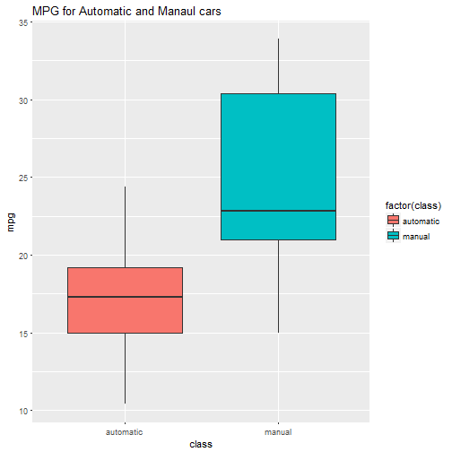
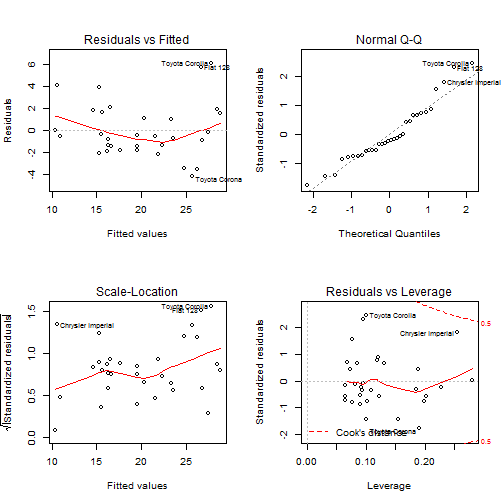

# Motor Trend Car Road Tests


                                        **Author: Abas-Mohamed**


# Overview

The data that We will analyse was extracted from the 1974 Motor Trend US magazine, and comprises fuel consumption and 10 aspects of automobile design and performance for 32 automobiles (1973-74 models). The data frame has 32 observations on 11 variables. **mpg** is Miles/(US) gallon, **cyl** is the Number of cylinders, **disp** is the Displacement, **hp** the Gross horsepower, **drat** the Rear axle ratio, **WT** is the Weight (1000 lbs), **qsec** 1/4 mile time , **am** is The Transmission (0 = automatic, 1 = manual), **gear** Number of forward gears and **Carb** is the Number of carburetors. Our goal is to determine whether an automatic or manual transmission is better for MPG, and quantifies the MPG difference between automatic and manual transmissions. 

## Summarising Data


We can see the significant difference between the two factors, The MPG of Manual transmission has higher mean than Automatic transmission. We will further support our statement by visualisation and hypothesis tests with Inferences in linear Regression.


```r
automatic <- mtcars[mtcars$am== 0,]
manual <- mtcars[mtcars$am == 1,]

summary(automatic$mpg)
```

```
##    Min. 1st Qu.  Median    Mean 3rd Qu.    Max. 
##   10.40   14.95   17.30   17.15   19.20   24.40
```

```r
summary(manual$mpg)
```

```
##    Min. 1st Qu.  Median    Mean 3rd Qu.    Max. 
##   15.00   21.00   22.80   24.39   30.40   33.90
```

## Exploratory analysis

The plot bellow reveals the difference in their average points. We see that the average MPG for Manual cars is higher than Automatic cars 

### Make the factor variable more descriptive


```r
require(ggplot2)
mtcars$class <- mtcars$am
mtcars$class[mtcars$class == 0 ] <- "automatic"
mtcars$class[mtcars$class == 1 ] <- "manual"


plot1 <- ggplot(mtcars,aes(x=class,y=mpg,fill=factor(class))) + 
         geom_boxplot() + ggtitle("MPG for Automatic and Manaul cars")
plot1
```



# Regression Analysis 


Before Regression analysis, We perform a simple t.test that will  quantifiy the MPG difference between automatic and manual transmission.


```r
require(knitr)
t.testing <- t.test(automatic$mpg,manual$mpg,var.equal = FALSE)
t.result <- data.frame("T.ratio" = t.testing$statistic, 
                       "Df" = t.testing$parameter,
                       "P.Value"= t.testing$p.value,
                       "Lower.Conf.Interval" =t.testing$conf.int[1],
                       "upper.Conf.Interval" = t.testing$conf.int[2],
                       "Auto.Mean" = t.testing$estimate[1],
                       "Man.Mean" = t.testing$estimate[2])
kable(t.result, align = "c" , caption = "MPG by cars transmission")
```


|   |  T.ratio  |    Df    |  P.Value  | Lower.Conf.Interval | upper.Conf.Interval | Auto.Mean | Man.Mean |
|:--|:---------:|:--------:|:---------:|:-------------------:|:-------------------:|:---------:|:--------:|
|t  | -3.767123 | 18.33225 | 0.0013736 |      -11.28019      |      -3.209684      | 17.14737  | 24.39231 |


The level of statistical significance is often expressed as the so-called p.value, In this case our P.value is **0.001374** which is less than the Statistical threshold value **alpha**. Therefor We do reject the Null hypothesis in favor of the alternative hypothesis and there is statistical significance between Automatic cars and Manual which tell us the MPG for manual transmission is better than the Automatic. 

### Regression Analysis


```r
fitmodel <- lm(mpg~factor(am), data = mtcars)
summary(fitmodel)
```

```
## 
## Call:
## lm(formula = mpg ~ factor(am), data = mtcars)
## 
## Residuals:
##     Min      1Q  Median      3Q     Max 
## -9.3923 -3.0923 -0.2974  3.2439  9.5077 
## 
## Coefficients:
##             Estimate Std. Error t value Pr(>|t|)    
## (Intercept)   17.147      1.125  15.247 1.13e-15 ***
## factor(am)1    7.245      1.764   4.106 0.000285 ***
## ---
## Signif. codes:  0 '***' 0.001 '**' 0.01 '*' 0.05 '.' 0.1 ' ' 1
## 
## Residual standard error: 4.902 on 30 degrees of freedom
## Multiple R-squared:  0.3598,	Adjusted R-squared:  0.3385 
## F-statistic: 16.86 on 1 and 30 DF,  p-value: 0.000285
```


from lm function We can safely deduce that MPG for Manual transmission is better than Automatic, the model estimates an expected 7.25 increase in MPG for every Manual cars, however the percent of variation explained by the model is not sufficient, here R squared is **0.36**, We will add multiple variable in order to improve our model, Multiple linear regression attempts to model the relationships between two or more explanatory variables and response variable in this case **MPG** is the response variable.  There are things to consider when choosing variables for Multiple regression analysis. First We have to make sure that the predictor variables in our multiple regression model are not correlated, this lead to a phenomenon called **Multicollinearity**. last but not least We need to omit all unnecessary variables because doing so may affect how We interpret the coefficients on others Variables.


```r
fit2 <- lm(mpg ~ am + cyl +  wt , data = mtcars)
summary(fit2)
```

```
## 
## Call:
## lm(formula = mpg ~ am + cyl + wt, data = mtcars)
## 
## Residuals:
##     Min      1Q  Median      3Q     Max 
## -4.1735 -1.5340 -0.5386  1.5864  6.0812 
## 
## Coefficients:
##             Estimate Std. Error t value Pr(>|t|)    
## (Intercept)  39.4179     2.6415  14.923 7.42e-15 ***
## am            0.1765     1.3045   0.135  0.89334    
## cyl          -1.5102     0.4223  -3.576  0.00129 ** 
## wt           -3.1251     0.9109  -3.431  0.00189 ** 
## ---
## Signif. codes:  0 '***' 0.001 '**' 0.01 '*' 0.05 '.' 0.1 ' ' 1
## 
## Residual standard error: 2.612 on 28 degrees of freedom
## Multiple R-squared:  0.8303,	Adjusted R-squared:  0.8122 
## F-statistic: 45.68 on 3 and 28 DF,  p-value: 6.51e-11
```


The first linear regression model that We conducted provides  7.25 increase in MPG for Manual but the model did not explain most of the variation, A more logical approach would be to incorporate a multivariable regression model to take into account other variables that would most likely affect a vehicle's gas mileage. After We added 2 more variables (number of cylinders and Weight (1000 lbs) ) our model improved with cylinders and weight as confounding variables, now The adjusted r-squared is 0.81.


# Appendix


```r
par(mfrow = c(2,2))
plot(fit2)
```



