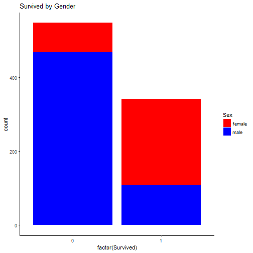
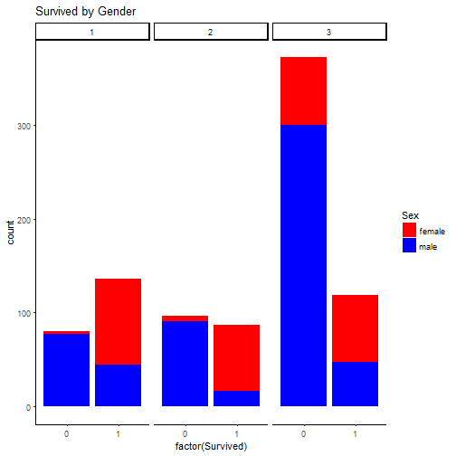

## Quadratic Discriminant Analysis Non-linear classification decision boundaries.


                                  
                                **Author : Abas-Hamza**  
                                  
                                  
  
  
  
  
  
* **Abstract**
* **Getting and cleaning the data**
* **Exploration Analysis**
* **Model Building** 
* **Predicting**  
* **Evaluating model accuracy**  

                                  


----------------------------------------------------------------------------------


* Abstract

In the previous project I've applied logistic Regression algorithm to the titanic dataset. The logistic regression algorithm traditionally limited to only two-class classification problems. For more than two classes the logistic regression won't perform better classification. Therefore Discriminant Analysis **(LDA & QDA)** is substantially more flexible than logistic regression. Discriminant analysis models the distribution of the predictors X separately in each of the response classes (i.e. "Yes",  "No" ), and then uses **Bayes' theorem ** for the probability of the response category given the value of X. Let's start with Quadratic Discriminant Analysis and comparing with LDA.

Quadratic discriminant analysis is a standard approach to supervised classification problems. 
It  models the ratio of each class as a Gaussian distribution. The Gaussian parameters for each class can be estimated with maximum likelihood (ML) estimation same as logistic regression.  QDA assumes the predictor variables X are drawn from a multivariate Gaussian distribution. But it doesn't  assume equality of covariances among the predictor variables X across each all levels of Y. 
The equality of covariance matrices is for LDA. If the two classes have equal covariance matrix,  We then obtain linear discriminant analysis instead of the quadratic. LDA tends to be a better than QDA if there are relatively few observations . In contrast, QDA is useful  if the training set is very large, or if the assumption of a common covariance matrix is not assumed. 

 In classification problems, we want to develop a model that assigns observations to categories or classes of the response variable. The data We have has been split into two groups: training set (train.csv) and test set (test.csv). The training set should be used to build our machine learning model and The test set should be used to see how well our model performs on unseen data. 


## Getting and cleaning the data. 

1) Loading required packages 


```r
trainingset <- read.csv("train.csv", stringsAsFactors = FALSE)
testset <- read.csv("test.csv", stringsAsFactors = FALSE)
```

#### Data structure 


```r
summary(trainingset)
```

```
##   PassengerId       Survived          Pclass          Name          
##  Min.   :  1.0   Min.   :0.0000   Min.   :1.000   Length:891        
##  1st Qu.:223.5   1st Qu.:0.0000   1st Qu.:2.000   Class :character  
##  Median :446.0   Median :0.0000   Median :3.000   Mode  :character  
##  Mean   :446.0   Mean   :0.3838   Mean   :2.309                     
##  3rd Qu.:668.5   3rd Qu.:1.0000   3rd Qu.:3.000                     
##  Max.   :891.0   Max.   :1.0000   Max.   :3.000                     
##                                                                     
##      Sex                 Age            SibSp           Parch       
##  Length:891         Min.   : 0.42   Min.   :0.000   Min.   :0.0000  
##  Class :character   1st Qu.:20.12   1st Qu.:0.000   1st Qu.:0.0000  
##  Mode  :character   Median :28.00   Median :0.000   Median :0.0000  
##                     Mean   :29.70   Mean   :0.523   Mean   :0.3816  
##                     3rd Qu.:38.00   3rd Qu.:1.000   3rd Qu.:0.0000  
##                     Max.   :80.00   Max.   :8.000   Max.   :6.0000  
##                     NA's   :177                                     
##     Ticket               Fare           Cabin             Embarked        
##  Length:891         Min.   :  0.00   Length:891         Length:891        
##  Class :character   1st Qu.:  7.91   Class :character   Class :character  
##  Mode  :character   Median : 14.45   Mode  :character   Mode  :character  
##                     Mean   : 32.20                                        
##                     3rd Qu.: 31.00                                        
##                     Max.   :512.33                                        
## 
```

```r
str(trainingset)
```

```
## 'data.frame':	891 obs. of  12 variables:
##  $ PassengerId: int  1 2 3 4 5 6 7 8 9 10 ...
##  $ Survived   : int  0 1 1 1 0 0 0 0 1 1 ...
##  $ Pclass     : int  3 1 3 1 3 3 1 3 3 2 ...
##  $ Name       : chr  "Braund, Mr. Owen Harris" "Cumings, Mrs. John Bradley (Florence Briggs Thayer)" "Heikkinen, Miss. Laina" "Futrelle, Mrs. Jacques Heath (Lily May Peel)" ...
##  $ Sex        : chr  "male" "female" "female" "female" ...
##  $ Age        : num  22 38 26 35 35 NA 54 2 27 14 ...
##  $ SibSp      : int  1 1 0 1 0 0 0 3 0 1 ...
##  $ Parch      : int  0 0 0 0 0 0 0 1 2 0 ...
##  $ Ticket     : chr  "A/5 21171" "PC 17599" "STON/O2. 3101282" "113803" ...
##  $ Fare       : num  7.25 71.28 7.92 53.1 8.05 ...
##  $ Cabin      : chr  "" "C85" "" "C123" ...
##  $ Embarked   : chr  "S" "C" "S" "S" ...
```


```r
dim(trainingset)
```

```
## [1] 891  12
```

```r
dim(testset)
```

```
## [1] 418  11
```

The training set has 891 observations and 12 variables and the testing set has 418 observations and 11 variables. We know that in test data we are missing the dichotomous variable Survival, because that is our challenge, we must predict that missing variable by creating a model.
We need to clean the training data befor training our model, In training data there are Unnecessary variables , We will leave out these variables as We move forward. 

### Dealing With Missing Values


```r
missingdata <- colSums(is.na(trainingset))
missingdata1 <- as.data.frame(missingdata)
```

There are 177 missing values in the variable age, Let's fixe it


```r
agemean <- mean(trainingset$Age, na.rm = TRUE)
rounded_mean <- round(agemean)
trainingset[is.na(trainingset$Age), "Age"] <- rounded_mean

class(trainingset$Age)
```

```
## [1] "numeric"
```


## Exploration  Analysis. 

Let's concentrate first on the relationship between Sex and survival.


```r
plot1 <- ggplot(trainingset, aes(x =factor(Survived), fill=Sex)) +  
         geom_bar() +
         ggtitle("Survived by Gender") + 
         theme_classic() + scale_fill_manual(values =c("red","blue"))
         
plot1
```



check it out how many passengers that survived vs did not and Survived by gender Vs did not .


```r
table(trainingset$Survived)
```

```
## 
##   0   1 
## 549 342
```

```r
table(trainingset$Sex,trainingset$Survived)
```

```
##         
##            0   1
##   female  81 233
##   male   468 109
```

```r
 proportion <- prop.table(table(trainingset$Sex,
              trainingset$Survived),margin = 1)
```

As We can see there are 342 out of 891 who survived most of them are females. The graph below shows the number of Survived VS not Survived by Passenger Class (1 = 1st; 2 = 2nd; 3 = 3rd) and gender. There are more men who died than Women in all Passenger's Classes and more Women who survived than men.  


```r
plot2 <- ggplot(trainingset, aes(x =factor(Survived), fill=Sex))         +  
         geom_bar() + facet_grid(.~Pclass) +
         ggtitle("Survived by Gender") + 
         theme_classic() + scale_fill_manual(values =c("red","blue"))
         
plot2
```



## Model Building

The model We are going to build is based on **Quadratic Discriminant Analysis**. QDA models the distribution of the predictors X separately in each of the response classes (i.e. "Yes",  "No" ), and then uses **Bayes' theorem ** for the probability of the response category given the value of X. 


#### Cleaning the Training Data

There are unnecessary variables that We need to leave out before building our model. 


```r
trainingsetdata <- trainingset[-c(1,4,9,11)]
names(trainingsetdata)
```

```
## [1] "Survived" "Pclass"   "Sex"      "Age"      "SibSp"    "Parch"   
## [7] "Fare"     "Embarked"
```

```r
trainingsetdata$Sex <- ifelse(trainingsetdata$Sex == "female", 1, 0)
```

We will now fit a QDA model to the titanic data. QDA is implemented in R using the qda() function, which is also part of the MASS library


```r
ModelTrain <- qda(Survived~ Age+Sex+Pclass+SibSp, data = trainingsetdata)

ModelTrain
```

```
## Call:
## qda(Survived ~ Age + Sex + Pclass + SibSp, data = trainingsetdata)
## 
## Prior probabilities of groups:
##         0         1 
## 0.6161616 0.3838384 
## 
## Group means:
##        Age       Sex   Pclass     SibSp
## 0 30.48361 0.1475410 2.531876 0.5537341
## 1 28.59553 0.6812865 1.950292 0.4736842
```

The output contains the group means and Prior probabilities of groups. But it does not contain the coefficients of the linear discriminants and logistic, because the QDA classifier involves a quadratic, rather than a linear.

#### Cleaning the Test Data


```r
missingtest_data <- colSums(is.na(testset))
kable(as.data.frame(missingtest_data), align = "c")
```


|            | missingtest_data |
|:-----------|:----------------:|
|PassengerId |        0         |
|Pclass      |        0         |
|Name        |        0         |
|Sex         |        0         |
|Age         |        86        |
|SibSp       |        0         |
|Parch       |        0         |
|Ticket      |        0         |
|Fare        |        1         |
|Cabin       |        0         |
|Embarked    |        0         |

```r
PassengerId <- testset[1]
testset$Sex <- ifelse(testset$Sex == "female", 1, 0)
testset[is.na(testset$Age), "Age"] <- round(mean(trainingset$Age, na.rm = TRUE))

testset <- testset[-c(1,3,7,8,9,10,11)]

names(testset)
```

```
## [1] "Pclass" "Sex"    "Age"    "SibSp"
```

# Predicting 
We have build our model, now our model is ready to be applied.


```r
predictModel <- predict( ModelTrain, newdata = testset)$class

survival <- predictModel

# Creating CSV for Kaggle Submission

Submit <- cbind(PassengerId,survival)
colnames(Submit) <- c("PassengerId", "Survived")

write.csv(Submit, file ="titanic2.csv", row.names = FALSE)
```

# Evaluating model accuracy.

After We build our model We need a method to evaluate the overall accuracy of the model. This allows us to determine if we have a good or bad model. There are number of ways to determine the accuracy of the model. For instance I am very confident that Quadratic Discriminant Analysis perform better analysis than logistic regression an Linear Discriminant Analysis.  QDA provides a non-linear quadratic decision boundary. The decision boundary is often non-linear, thus  QDA gives better results. The model accuracy can be determine by the test error rate, it is remarkably useful to evaluate the test error rate another word the misclassification. A lower error rate indicates a good model.  There are various ways to asses the goodness of the model such ROC,Confusion matrix etc... none of these methods can outperform the Test-Error-rate.  


```r
predictz <- predict(ModelTrain,trainingsetdata)$class

table(predictz)
```

```
## predictz
##   0   1 
## 541 350
```

```r
table(predictz,trainingsetdata$Survived)
```

```
##         
## predictz   0   1
##        0 455  86
##        1  94 256
```

```r
mean(predictz == trainingsetdata$Survived)
```

```
## [1] 0.7979798
```

```r
mean(predictz != trainingsetdata$Survived)
```

```
## [1] 0.2020202
```


Substantially with QDA the model improved, the QDA predictions are accurate almost 80% of the time. This level of accuracy is quite important , because it is always quite hard to model accurately. This suggests that the quadratic term assumed by QDA may capture the true relationship more accurately than the linear forms assumed by LDA and logistic regression. Evidently We get some improvement with the QDA model we probably want to assess other techniques to improve our classification performance before selecting the best model. 

